# FHEM App
**FHEMApp** ist eine Web-Application zur Steuerung deiner Smarthome Umgebung. Sie wurde als Frontend für den Einsatz mit FHEM(tm) entwickelt. **FHEMApp** ist für den Betrieb auf unterschiedlichen Geräten optimiert. Die Elemente zur Steuerung der verschiedenen SmartHome-Geräte sind sehr einfach zu bedienen. Für die Einrichtung von **FHEMApp** sind keine Programmierkenntnisse erforderlich. **FHEMApp** wird komplett über FHEM konfiguriert.

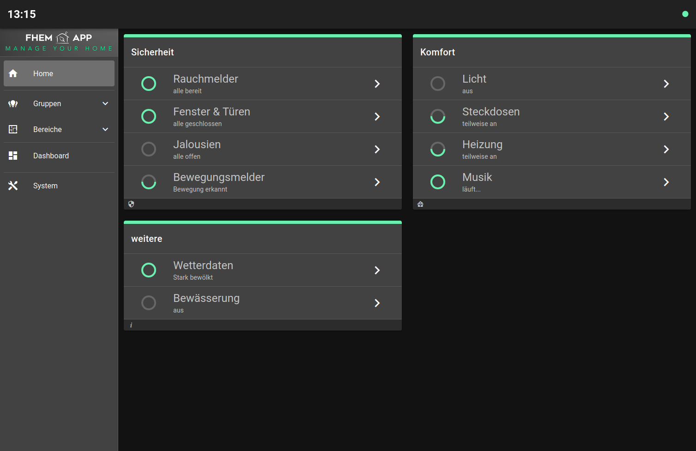*Beispiel für eine Startseite in der Desktopansicht*

*Beispiel für Geräte in der Desktopansicht*

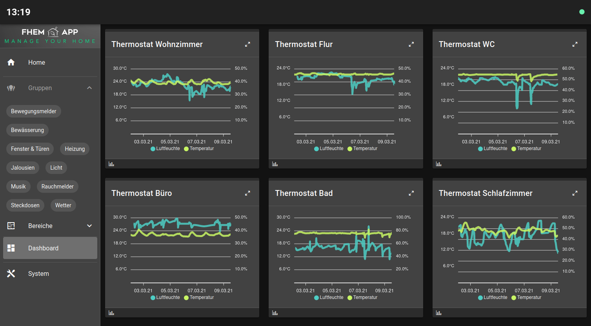*Beispiel für Grafiken in der Desktopansicht*

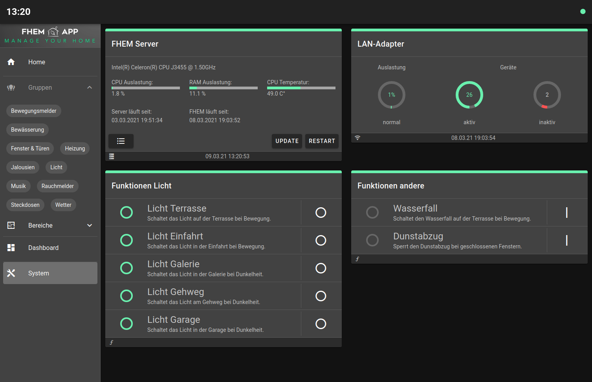*Beispiel für Systemzustand in der Desktopansicht*

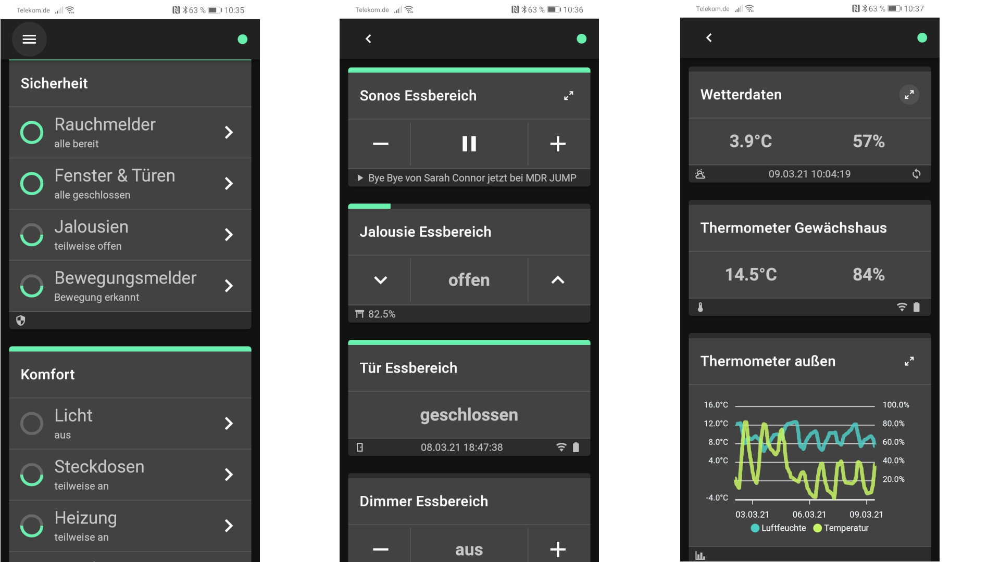
*Beispiele für die App in der Smartphoneansicht*

# Systemanforderungen
Für den Betrieb der **FHEMApp** wird FHEM(tm) benötigt.
* FHEM https://fhem.de/
* optional kann die App auch auf einem separaten Web-Server (z.B. Apache https://httpd.apache.org/, lighttpd https://www.lighttpd.net/) betrieben werden.

# Installation
Kopiert einfach alle Dateien und Unterverzeichnisse aus dem Ordner [www/fhemapp](./www/fhemapp) in eure FHEM-Installation unter **opt/fhem/www/fhemapp** bzw. in das gewünschte Verzeichnis auf eurem Webserver. Danach sollte folgende Verzeichnisstruktur auf eurem Webserver vorhanden sein.
```bash
.
└─ fhemapp
    ├── apple-touch-icon.png
    ├── favicon.png
    ├── index.html
    ├── cfg
    ├── css
    ├── img
    └── js
```

# Grundkonfiguration der FHEMApp verändern
Die Grundkonfiguration von **FHEMApp** befindet sich in der Datei `config.json` im Verzeichnis `.../fhemapp/cfg`. In dieser können bei Bedarf Anpassungen vorgenommen werden. Dies ist insbesondere wichtig, wenn ihr **FHEMApp** auf einem separaten Webserver installiert. Die Konfigurationsdatei könnt ihr über einen normalen Texteditor bearbeiten, um die folgenden Einstellungen zu verändern.

### Verbindungseinstellung für FHEM (optional)
Wenn ihr **FHEMApp** unter *opt/fhem/www/fhemapp* abgelegt habt, müssen keine Verbindungseinstellungen in der `config.json` hinterlegt werden. Einige Browser stellen keine websocket Verbindung zu FHEM her. In diesem Fall kann der Verbindungstyp über den Parameter `type` auf `longpoll` geändert werden. Solltet ihr **FHEMApp** auf einem separaten Webserver (z.B. apache) betreiben, dann sind die Angaben `location`, `port` und `path` notwendig. Das folgende Beispiel zeigt die Verbindungseinstellungen für eine Standard FHEM-Installation.
```
"connection": {
  "location": "http://fhem",
  "port": "8083",
  "path": "fhem",
  "type": "websocket"
},
```

### Performanceeinstellungen für FHEMApp (optional)
Wenn ihr in **FHEMApp** Daten aus FHEM-Logs in Charts darstellt, ist es ggf. sinnvoll die Anzahl der `maxChartPoints` zu reduzieren um die Ladezeit zu verkürzen. Über den Parameter `logBuffer` könnt ihr die Anzahl der Logeinträge verändern, die **FHEMApp** zwischenspeichert. Dies ist nur für die Fehleranalyse notwendig.
```
"options": {
  "maxChartPoints": 100,
  "logBuffer": 500
},
```

### Anzeigeeinstellungen für FHEMApp (optional)
Wenn ihr in **FHEMApp** bei der mobilen Ansicht (1-spaltiges Layout) im Header sehen wollt, in welcher Bereich bzw. in welche Gruppe euch gerade befindet, dann könnt ihr unter Options den Parameter `mobileHeader` setzen. Ebenfalls in der mobilen Ansicht könnt ihr über den Parameter `homeBtn` einen Home-Button auf der rechten Seite im Header einblenden. Weiterhin könnt ihr über den Parameter `reloadBtn` einen Button für einen kompletten Browser-Refresh im Header aktivieren. Über die Parameter `expandGroups` bzw. `expandRooms` könnt ihr festlegen, ob die Gruppen bzw. Räume in der Navigationsleiste beim Starten von **FHEMApp** geöffnet oder geschlossen sein sollen. Über den Parameter `lang` kann die Sprache der App umgestellt werden. Aktuell stehen `de` (deutsch) und `en` (englisch) zur Verfügung. Über den Parameter `clockFormat` kann die Anzeige der Uhrzeit im Header verändert werden.
```
"options": {
  "mobileHeader": true,
  "reloadBtn": true,
  "homeBtn": true,
  "expandGroups": false,
  "expandRooms": false,
  "lang": "de",
  "clockFormat": { "hour": "2-digit", "minute": "2-digit", "second": "2-digit" }
},
```

### Debug-Modus für FHEMApp (optional)
Bei aktiviertem DebugModus könnt ihr oben rechts im Header direkt das "Systemlog-Protokoll aufrufen". Weiterhin wird in diesem Modus beim Standard-Template oben rechts ein **{...}** Symbol angezeigt. Bei Klick auf dieses Symbol könnt ihr die interne Datenstruktur des jeweiligen Templates anzeigen. Für die Fehlersuche wird das *debugLevel* 5 empfohlen.

```
"options": {
  "debugMode": true,
  "debugLevel": 5
},
```

Auch ohne Debug/Modus kann man das Systemlog-Protokoll über die URL `http://<deine_ip>:8083/fhem/fhemapp/index.html#/syslog` anzeigen.

### Themeneinstellungen für FHEMApp (optional)
Zusätzlich könnt ihr das Farbschema von **FHEMApp** individuell anpassen. Grundsätzlich könnt ihr zwischen einem *dunklen* und einem *hellen* Layout über den Parameter `dark` (`true` bzw. `false`) wechseln. Weiterhin könnt ihr die einzelnen Farben für die beiden Farbschemen unter dem Parameter `themes` individuell anpassen. Siehe dazu auch [(Vuetify Customizing)](https://vuetifyjs.com/en/features/theme/#customizing)    
```
"theme": {
    "dark": false,
    "themes": {
      "light": {
        "primary": "#00695C",
        "secondary": "#ECEFF1",
        "accent": "#80CBC4",
        "error": "#e91e63",
        "warning": "#ffc107",
        "info": "#03a9f4",
        "success": "#80CBC4"
      },
      "dark": {
      }
    }
  }
```
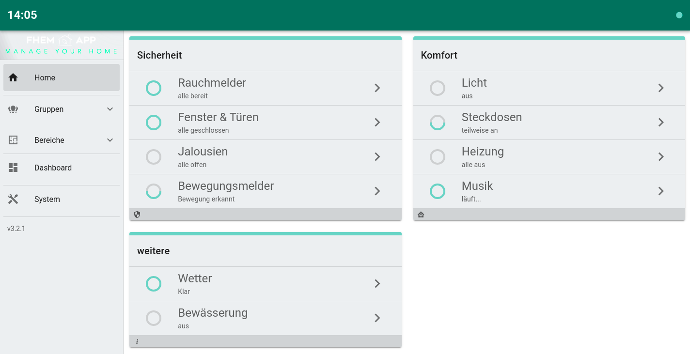*Beispiel für helles Layout*

# Grundeinstellung in FHEM
Bevor ihr die gewünschten Geräte für die Anzeige in der **FHEMApp** konfiguriert sind sind folgende Grundeinstellungen in FHEM notwendig.
1. Müsst ihr ein neues globales User-Attribut mit dem Name `appOptions` im FHEM Device `global` hinzufügen. [(siehe auch)](https://fhem.de/commandref_DE.html#global) **Wichtig:** achtet bitte darauf, dass bestehende user-Attribute dabei nicht entfernt werden!
Damit ihr das Attribut `appOptions` später gut pflegen könnt, empfielt es sich das Attribut wie folgt zu hinterlegen.
```
appOptions:textField-long
```
2. Wenn ihr **FHEMApp** außerhalb von FHEM auf einem separaten Web-Server betreibt, müsst ihr in eurem *FHEM-Device* `FHEMWEB` das Attribut `CORS` auf `1` setzen. [(siehe auch)](https://fhem.de/commandref_DE.html#FHEMWEB) Das folgende Beispiel zeigt einen Auszug aus der Datei *fhem.cfg* nachdem die Grundeinstellung vorgenommen wurde.
```
define WEB FHEMWEB 8083 global
attr WEB CORS 1
attr WEB stylesheetPrefix default
```

# Aufruf der App
Nachdem du **FHEMApp** wie beschrieben installiert hast, kannst du diese über `http://<deine_ip>:8083/fhem/fhemapp/index.html` bzw. über die von dir gewählten URL deines Webservers aufrufen. Als nächstes musst du mindestens ein FHEM-Device für die Anzeige in **FHEMApp** konfigurieren. Wie das funktioniert wird in den folgenden Abschnitten beschrieben.

# Konfiguration der Geräte in FHEM
Jedes SmartHome-Gerät (Device) welches in **FHEMApp** angezeigt werden soll, konfiguriert ihr nun direkt in FHEM. Dazu verwendet ihr das neu angelegte FHEM-Attribut `appOptions` sowie weitere FHEM-Attribute wie `alias`,`group`,`room` oder `sortby`.

### appOptions
Das Attribut `appOptions` kann mit unterschiedlichen Parametern befüllt werden, um die Darstellung des jeweiligen Devices in **FHEMApp** zu steuern. Es wird von **FHEMApp** als Object im `JSON-Format` verarbeitet und kann folgende Parameter beinhalten:

```
{
  "template": "string",             - steuert über welches Template das Device dargestellt wird
  "name": "string",                 - kann alternativ zum FHEM-Attribut 'alias' verwendet werden
  "room": "string",                 - kann alternativ zum FHEM-Attribut 'room' verwendet werden
  "group": "string",                - kann alternativ zum FHEM-Attribut 'group' verwendet werden
  "sortby": "string",               - kann alternativ zum FHEM-Attribut 'sortby' verwendet werden
  "home": true,                     - zeigt ein Device auf der Startseite an
  "dashboard": true,                - zeigt ein Device im Dashboard an
  "system": true,                   - zeigt ein Device in den Systemeinstellungen an
  "setup": { object },              - ermöglicht individuelle Anpassungen des Templates
  "connected": { object },          - bindet zusätzliche Devices in das Template ein
  "panel": { object },              - definiert die Darstellung des Devices in einem Panel
  "chartDef": ["def1", "def2", ...] - legt die Datenquellen für Grafiken fest
}
```

### Template zuweisen
Damit ein Gerät in der **FHEMApp** zur Verfügung steht, müsst ihr dem jeweiligen Device in FHEM einem *Template* zuordnen. In der **FHEMApp** stehen verschiedene [Templates](#übersicht-der-verfügbaren-templates) zur Verfügung. Dazu nutzt ihr das FHEM-Attribut `appOptions`  und definiert ein *Template* über folgenden Parameter  `{ "template": "switch" }` (Beispiel für einen Schalter)

### weitere FHEM Attribute verwenden
Nachdem ihr dem Device ein *Template* zugeordnet habt, könnt ihr defnieren unter welchem *Name* und in welchen *Menüpunkten* euer Device in **FHEMApp** angezeigt wird. Dazu nutzt ihr das FHEM-Attribut `alias` für den Name des Gerätes, das FHEM-Attribut `group` für die Anzeige im Menüpunkt *Gruppen* und das FHEM-Attribut `room` für die Anzeige im Menüpunkt *Bereiche*. Weiterhin könnt ihr das FHEM-Attribut `sortby` nutzen um die Reihenfolge der Templates in **FHEMApp** festzulegen. Alternativ können diese Parameter auch über `appOptions` [siehe](#appoptions) definiert werden, wenn ihr die FHEM-Attribute `alias`, `group`, `room` oder `sortby` in eurer FHEM-Installation anderweitig verwendet.
Wenn die FHEM-Attribute `room`, `group` oder `sortby` in **FHEMApp** komplett ignoriert werden sollen, dann muss dies in der Datei `config.json` unter dem Parameter `options` wie folgt eingestellt werden.
```
  "options": {
    "ignoreFhemGroup": true,
    "ignoreFhemRoom": true,
    "ignoreFhemSortby": true
  }
```

*Definition in FHEM*<br>
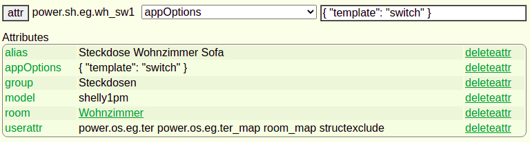

*Anzeige in FHEMApp*<br>
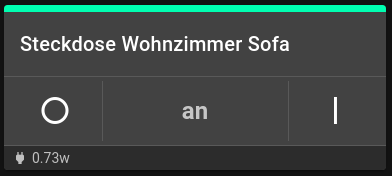

# Aufbau von Standard Templates
In **FHEMApp** werden *Standard Templates* für viele Aktoren und Sensoren zur Verfügung gestellt. Jedes *Standard Template* besteht aus einer Grundstruktur mit einheitlichen Elementen.

- **die Statusbar** - diese zeigt den aktuellen Status über einen farbigen Streifen am oberen Rand des *Templates* an.
- **die Gerätebezeichnung** - befindet sich direkt unter der *Statusbar* und zeigt den Wert aus dem FHEM-Attribut `alias` oder den über `appOptions` definierten Wert an.
- **der Steuerteil** - befindet sich unter der *Gerätebezeichnung* und enthält die im *Template* definierten Tasten bzw. Statuswerte. Der Steuerteil kann mehrere Ebenen enthalten, sodass mehrere Tasten oder Statuswerte angezeigt werden können. Verfügt das Template über mehrere Ebenen, so wird ein kleines Symbol für die Umschaltung der Ebenen rechts neben der Gerätebezeichnung ausgegeben.
- **die Infobar** - befindet sich am unteren Rand und zeigt weitere Informationen zum jeweiligen *Device* an.

*Beispiel für ein Standard Template*<br>
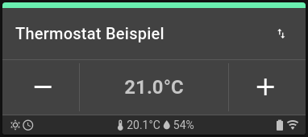

Standard Templates können über `appOptions` individuell angepasst werden. Zudem können eigene Templates in der Datei `config.json` definiert werden. Die Anpassungsmöglichkeiten werden [hier](#standard-templates-anpassen) beschrieben.

Grundsätzlich ist es möglich weitere Templates auf Basis des Vue/Vuetify-Frameworks [siehe](https://vuetifyjs.com/en/) zu entwickeln und in **FHEMApp** zu integrieren.   

# Standard Templates anpassen
Standard Templates enthalten eine Vielzahl von Elementen. Jedes Element kann dabei auf `Readings`, `Attribute` oder `Internals` von FHEM-Devices zugreifen und auf deren Werte reagieren.

Jedes Element kann direkt über `appOptions` angepasst werden. Dies erfolgt über den Parameter `setup`
```
{ "template": "switch", "setup": { "status": {...}, "main": [...], "info": {...} } }
```
# eigene Templates erstellen
Alternativ können eigene Templates erstellt und im Verzeichnis `.../fhemapp/cfg/` als JSON-Datei in folgender Form `templ_<templatename>.json` abgelegt werden. Der Dateiname muss mit `templ_` beginnen. Danach folgt der **Name** des Templates, so wie er auch in `appOptions` angegeben wird. *(Achtung: Groß/Kleinschreibung ist zu beachten)*.

In den Template-Dateien können folgende Eigenschaften definiert werden. Die Zuweisung der einzelnen Eigenschaften wird [hier](#zuweisung-von-elementen) beschrieben.
```
{
  "name": "example",
  "description": "kurze Beschreibung"
  "author": "name",
  "date": "YYYY-MM-DD",
  "size": "col-12 col-sm-6 col-md-4 col-lg-4",
  "expand": false,
  "expanded": false,
  "show": ["reading:value:show:size:sortby"],
  "status": {
    "bar": ["reading:value:level:color:invert"],
    "error": ["reading:value:level:color:text"],
    "min": 0,
    "max": 100
  },
  "main": [
    {
      "leftBtn": ["reading:value:icon:disabled"],
      "leftClick": ["reading:value:set_param"],
      "leftLong": ["reading:value:set_param"],
      "leftLongRelease": ["reading:value:set_param"],
      "leftMenu": ["text:set_param"],
      "text": ["reading:value:text"],
      "text2": ["reading:value:text"],
      "slider": ["reading:value:set_param:current:min:max:steps"],
      "midBtn": ["reading:value:icon:disabled"],
      "midClick": ["reading:value:set_param"],
      "midLong": ["reading:value:set_param"],
      "midLongRelease": ["reading:value:set_param"],
      "midMenu": ["text:set_param"],
      "rightBtn": ["reading:value:icon:disabled"],
      "rightClick": ["reading:value:set_param"],
      "rightLong": ["reading:value:set_param"],
      "rightLongRelease": ["reading:value:set_param"],
      "rightMenu": ["text:set_param"]
    }
  ],
  "info": {
    "left1": ["reading:value:text:icon"],
    "left2": ["reading:value:text:icon"],
    "mid1": ["reading:value:text:icon"],
    "mid2": ["reading:value:text:icon"],
    "right1": ["reading:value:text:icon"],
    "right2": ["reading:value:text:icon"]
  }
}
```
## Zuweisung von Elementen
Damit ein Element auf den Wert eines bestimmten `Readings` reagieren kann, muss dies entsprechend definiert werden. Jede Zuweisung enthält mindestens ein *reading*, einen *wert* und einen bzw. mehrere *Parameter*.
- **reading** kann sowohl auf `Readings`, `Attribute` als auch  `Internals` eines FHEM-Devices zeigen.
- **wert** kann *strings*, *zahlen* oder *regexp* enthalten. Für Zahlen gilt *reading >= wert*
- **parameter** betrifft das Element selbst, also z.B. das Icon, den Text oder die Farbe. *Hinweis:* Die Parameter sind je Element definiert und müssen ein der korrekten Reihenfolge angegeben werden. (siehe verfügbare Elemente)

Beispiele:
- `["state:on:an"]` prüft das FHEM-Reading `state` auf den Wert `on` und liefert für das Element den Text `an` zurück.
- `["level:30:mdi-weather-sunny"]` prüft das FHEM-Reading `level` auf den Wert >=30 und gibt das Icon `*` zurück.
- `["state:on:an","state:off:aus","state::Status %s"]` prüft das FHEM-Reading `state` der Reihenfolge nach zuerst auf den Wert `on`, danach `off` und zuletzt jeden beliebigen anderen Wert. Im letzten Fall wird *%s* durch den Wert des Readings ersetzt. Die Bedingungen werden von links nach rechts geprüft. Sobald die erste Bedingung zutrifft, wird die Prüfung beendet. Deshalb ist es wichtig, die Bedingungen ist der richtigen Reihenfolge zu definieren.

### Ersetzungsmöglichkeiten
- **%s** - liefert das *Reading* als Zeichenkette
- **%n.2** - liefert das *Reading* als Zahlenwert mit der gewünschten Anzahl an Nachkommastellen. Sollte das Reading aus Text und Zahlen bestehen, so wird der erste Zahlenwert zurückgegeben
- **%i1** - erhöht (%i1.5) bzw. verringert (%i-1.5) das *Reading* um den Wert. Hierfür muss das *Reading* Zahlenwerte enthalten.
- **%t** - liefert das *Reading* als Zeitstempel im Format TT.MM.JJJJ hh:mm:ss zurück
- **%a** - liefert das *Reading* als Zeitraum zwischen jetzt und dem Readingwert im Format Tage h min zurück
- **%v** - ausschließlich in Verbindung mit dem Element *slider* notwendig.
- **\&#058;** - HTML-entity wenn ein Doppelpunkt ausgegeben werden soll
## Icons
Es werden die Icons aus der [Material Designs Icon Bibliothek](https://materialdesignicons.com/) verwendet. Wenn man auf deren [Webseite](https://materialdesignicons.com/) ein Icon ausgesucht hat, wird dessen Bezeichnung in einem Popup angezeigt, wenn man mit der Maus darauf zeigt. Als Name des Icons in fhemApp muss diese Bezeichnung mit vorangestelltem `mdi-` verwendet werden, also z.B. `mdi-lightbulb-off-outline`.

## verfügbare Elemente
|Bereich|Element|Zuweisung|Beschreibung|
|-------|-------|-----|-------------|
|show|template|reading:wert:show:size:sortby|definiert, ob ein Template angezeigt wird, welche Breite es hat und an welcher Position das Template steht. Die Parameter *size* und *sortby* überschreiben dabei die Voreinstellungen|
|status|bar|reading:wert:level:color:invert|definiert mit welcher **Farbe** und mit welchem **Level** der Status angezeigt wird. Bei Angabe von invert wird *level* invertiert|
|status|error|reading:wert:level:color:text|definiert mit welcher **Farbe** und mit welchem **Level** Fehler angezeigt werden. Weiterhin wird die **Fehlermeldung** definiert und alle Bedienelemente des Templates ausgeblendet.|
|status|min|number|(optional) legt den minimalen Wert für **Level** fest. *Standard: 0* |
|status|max|number|(optional) legt den maximalen Wert für **Level** fest. *Standard: 100* |
|main|leftBtn|reading:wert:icon:disabled (alternativ: icon)|definiert welches *Icon* auf der linken Taste angezeigt wird. Optional kann das Flag *disabled* gesetzt werden. Icon Bibliothek [siehe](https://materialdesignicons.com/)|
|main|leftClick|reading:wert:cmd|defniert welches FHEM-Kommando bei Klick auf die linke Taste abgesendet wird. [siehe auch](#hinweis-zur-definition-von-fhem-Kommandos)|
|main|leftLong|reading:wert:cmd|defniert welches FHEM-Kommando bei langem Halten der linken Taste abgesendet wird. [siehe auch](#hinweis-zur-definition-von-fhem-Kommandos)|
|main|leftLongRelease|reading:wert:cmd|defniert welches FHEM-Kommando beim loslassen nach langem Halten der linken Taste abgesendet wird. [siehe auch](#hinweis-zur-definition-von-fhem-Kommandos)|
|main|leftMenu|text:cmd|definiert für das **linke Menü** die Texte und FHEM-Kommandos. Wenn dieses Element zugewiesen wird, klappt bei Klick auf die linke Taste ein Menü auf. *Hinweis:* leftClick, leftLong und leftLongRelease stehen bei Zuweisung des Menüs nicht zur Verfügung.|
|main|text|reading:wert:text|definiert den **ersten Text** der in der Mitte angezeigt wird|
|main|text2|reading:wert:text|definiert den **zweiten Text** der in der Mitte angezeigt wird *Hinweis:* bei Verwendung von Tasten sollte auf die Anzeige eines zweiten Wertes verzichtet werden, da die Breite des Templates im Normalfall nicht ausreicht|
|main|slider|reading:wert:cmd:current:min:max:steps|stellt einen **Slider** in der Mitte dar. In diesem Fall werden die Elemente `text` und `text2` nicht angezeigt und evtl. definierte Tasten reagieren nur auf `leftClick` bzw. `rightClick`. *Wichtig:* `cmd` muss die Ersetzung *%v* (den aktuellen Wert des Sliders) enthalten. `current` sollte nur die Ersetzung *%n* enthalten, damit der Slider den aktuellen Wert des Readings anzeigt. `min` und `max` begrenzen die Sliderwerte. `steps` definiert die Schritte in denen der Slider die Werte verändert. *Beispiel:* `["pct::pct %v:%n:0:100:1"]` verbindet das Reading `pct` mit einem Slider und begrenzt die Werte auf 0-100 und verändert die Werte jeweils um 1|
|main|midtBtn|reading:wert:icon:disabled (alternativ: icon)|definiert welches *Icon* auf der mittlerren Taste angezeigt wird. Optional kann das Flag *disabled* gesetzt werden. Icon Bibliothek [siehe](https://materialdesignicons.com/)|
|main|midClick|reading:wert:cmd|defniert welches FHEM-Kommando bei Klick auf die mittlere Taste abgesendet wird. [siehe auch](#hinweis-zur-definition-von-fhem-Kommandos)|
|main|midLong|reading:wert:cmd|defniert welches FHEM-Kommando bei langem Halten der mittleren Taste abgesendet wird. [siehe auch](#hinweis-zur-definition-von-fhem-Kommandos)|
|main|midLongRelease|reading:wert:cmd|defniert welches FHEM-Kommando beim loslassen nach langem Halten der mittleren Taste abgesendet wird. [siehe auch](#hinweis-zur-definition-von-fhem-Kommandos)|
|main|midMenu|text:cmd|definiert für das **mittlere Menü** die Texte und FHEM-Kommandos. Wenn dieses Element zugewiesen wird, klappt bei Klick auf die mittlere Taste ein Menü auf. *Hinweis:* midClick, midLong und midLongRelease stehen bei Zuweisung des Menüs nicht zur Verfügung.|
|main|rightBtn|reading:wert:icon:disabled (alternativ: icon)|definiert welches *Icon* auf der rechten Taste angezeigt wird. Optional kann das Flag *disabled* gesetzt werden. Icon Bibliothek [siehe](https://materialdesignicons.com/)|
|main|leftClick|reading:wert:cmd|defniert welches FHEM-Kommando bei Klick auf die rechte Taste abgesendet wird. [siehe auch](#hinweis-zur-definition-von-fhem-Kommandos)|
|main|rightLong|reading:wert:cmd|defniert welches FHEM-Kommando bei langem Halten der rechten Taste abgesendet wird. [siehe auch](#hinweis-zur-definition-von-fhem-Kommandos)|
|main|rightLongRelease|reading:wert:cmd|defniert welches FHEM-Kommando beim loslassen nach langem Halten der rechten Taste abgesendet wird. [siehe auch](#hinweis-zur-definition-von-fhem-Kommandos)|
|main|rightMenu|text:cmd|definiert für das **rechte Menü** die Texte und FHEM-Kommandos. Wenn dieses Element zugewiesen wird, klappt bei Klick auf die rechte Taste ein Menü auf. *Hinweis:* rightClick, rightLong und rightLongRelease stehen bei Zuweisung des Menüs nicht zur Verfügung.|
|info|left1..2,<br>mid1..2,<br>right1..2|reading:wert:text:icon:color|definiert welches **Icon** und welcher **Text** in der Infozeile angezeigt wird. Mit **color** kann optional die Farbe den Icons verändert werden|

## Hinweis zur Definition von FHEM-Kommandos
Bei Definition der FHEM-Kommandos kann `set <devicename>` weggelassen werden. Alternativ kann der Name eines bestimmten FHEM-Devices angegeben oder auf ein *Connected-Device* verwiesen werden.

*Varianten:*
- normale Definition: `["state::on"]` - schaltet das Device dem das Template zugeordnet ist ein.
- alternative Definition: `["state::set mein_device on"]` - schaltet *mein_device* ein.
- Definition über Connected: `["state::set Connected.button on"]` - schaltet das Device welches im Template als `"connected": { "button": "<device>" }` definiert ist ein.

## Breite von Templates
Die Templates von **FHEMApp** sind optimal an die verschiedenen Displayformate angepasst. Es gibt dennoch die Möglichkeit, die relative Breite von Templates anzupassen. Der Anzeigebereich von **FHEMApp** ist dabei in 12 gleiche "Teile" untergliedert. Wenn man einem Template z.B. alle 12 Teile zuweist, dann nimmt es die volle Breite ein. Wieviele "Teile" ein Template einnehmen soll, kann zusätzlich unter Berücksichtigung des Displayformates definiert werden. z.B. alle 12 Teile bei schmalen Displays und 3 Teile (25%) bei breiten Displays. Folgende Displayformate werden unterschieden.

|Device|Code|Type|Range|
|-----------|----|------------------------|---------|
Extra small	| xs |	Small to large phone	| < 600px |
Small	| sm |	Small to medium tablet | 600px > < 960px |
Medium	| md | Large tablet to laptop | 960px > < 1264px |
Large	| lg | Desktop | 1264px > < 1904px |
Extra large |	xl | 4k and ultra-wide | > 1904px |

Die Definition der Templatebreite erfolgt mit dem Parameter `size`. Der String muss mind. 1 Definition enhalten. Eine Definition beginnt jeweils mit `col-`. Danach folgt (optional) der Displaycode (s.o.) und endet mit den "Teilen" (1-12) Folgendes Beispiel zeigt die voreingestellte Definition für Standard Templates.   
```
  "size": "col-12 col-sm-6 col-md-4 col-lg-4"
```

## Aufklappen von Templates
Wenn unter `main` mehrere Level definiert wurden, dann können die Level im Template umgeschaltet werden. Alternativ kann über den Parameter `expand` das Aufklappen des Templates aktiviert werden. In diesem Fall werden alle definierten Level untereinander dargestellt. Soll das Template sofort beim Laden aufgeklappt werden, so muss zusätzlich der Parameter `expanded` gesetzt werden.
Folgendes Beispiel zeigt die voreingestellte Definition für Standard Templates.
```
  "expand": false
  "expanded": false
```

## Verwendung des Parameters connected innerhalb von appOptions
Im Normalfall verbindest du ein Template immer mit genau einem Device. Somit kannst du erstmal alle Readings/Internals/Attribute von diesem "abgreifen" und im Standard Template verwenden. Wenn du jedoch komplexere Templates erstellen möchtest, die Daten aus unterschiedlichen Devices darstellen sollen, dann kommt `connected` zum Einsatz. Das bietet sich z.B. bei Thermostaten an, wenn du im Template zusätzlich sehen möchtest, was das zugehörige Heizungsventil macht. Oder wenn, wie bei Homematic-Thermostaten, mehrere Kanäle vorhanden sind.

Mit dem Parameter `connected` definierst du in `appOptions` also die Devices, die du noch im Template benötigst. Die Angabe erfolgt mit `"connected: { "name1": "device1", "name2": "device2", ... }`. *name* ist ein von dir gewählter Name, über den du später in der Templatedefinition auf dieses verbundene Device zugreifen kannst. Der "connected-Teil" in `appOptions` könnte damit wie folgt aussehen:
```
"connected": { "ventil": "fhem.heizung.ventil.wohnzimmer", "empfängerkanal": "fhem.thermostate.wohnzimmer.empfänger" }
```
Wenn du jetzt mehrere Devices in einem Template hast, würden ja "Dopplungen" von Readings/Internals/Attributen entstehen. Damit du nun bei der Zuweisung auf das richtige Reading zugreifst, muss das Reading in deiner Wertzuweisung genauer spezifiziert werden, indem du den kompletten "JSon-Objectpfad" angibst. Im o.g. Beispiel wäre das dann z.B.
```
["Connected.ventil.Readings.state.Value::%n % geöffnet"]
```
*Wichtig:* in der appOptions-Definition wird der Parameter "connected" klein geschrieben. Im "JSon-Object" musst du "Connected" schreiben.

# Übersicht der verfügbaren Templates
| Template | Beschreibung | Beispiel |
|----------|--------------|----------|
| [switch](#template-switch) | Schalteraktoren (optional mit Leistungsmessung) |  |
| [dimmer](#template-dimmer) | Dimmer | 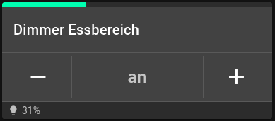 |
| [dimmer3](#template-dimmer) | Dimmer (Variante für HUEDevice) | |
| [light](#template-light) | Lichtschalter | 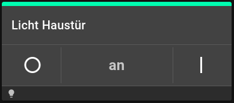 |
| [thermostat](#template-thermostat) | Raumthermostat | 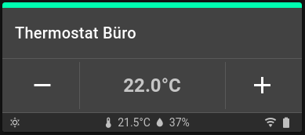 |
| [shutter](#template-shutter) | Jalousieschalter | 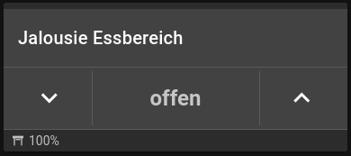 |
| [shutter2](#template-shutter) | Jalousieschalter (Variante) |  |
| [shutter3](#template-shutter) | Jalousieschalter (Variante für Tasmota-Geräte) | |
| [thermometer](#template-thermometer) | Temperatursensor  | 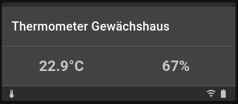 |
| [smokedetect](#template-smokedetect) | Rauchmelder | 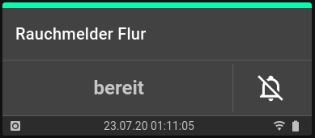 |
| [contact](#template-contact)    | Tür/Fensterkontakt | 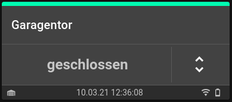 |
| [motiondetect](#template-motiondetect) | Bewegungsmelder | 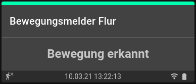 |
| [watersensor](#template-watersensor) | Zisternensensor | 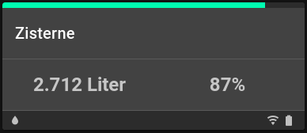 |
| [sonosplay](#template-sonosplay) | Sonosplayer | 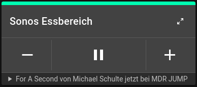 |
| [scenes](#template-scenes) | LightScenes | 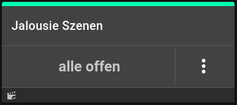 |
| [panel](#template-panel) | Panel zur Gruppierung mehrerer Devices | 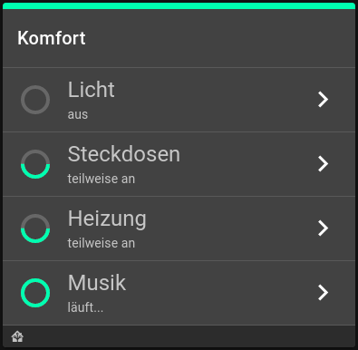 |
| [chart](#template-chart) | Diagramm zur Visualisierung von Log-Daten |  |
| [cam](#template-cam) | Anzeige von Kamerastreams |  |
| weather | Wettervorhersage (darksky-API und Proplanta-API) | 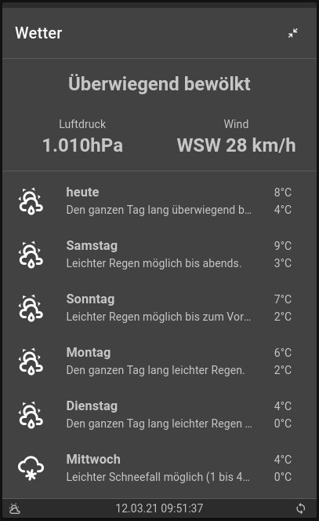 |
| [sysmon](#template-sysmon) | Systemmonitor | 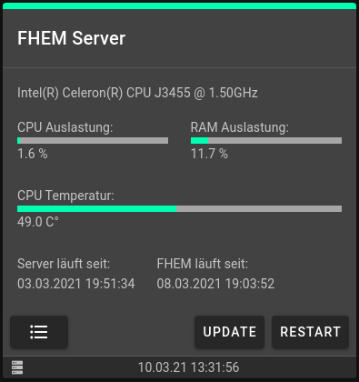 |
| hmlan | HMLAN-Adapter | 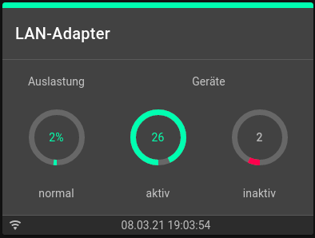 |

# Template Switch
Dieses Template kann für unterschiedliche Schaltaktoren verwendet werden. Dabei werden verschiedene Varianten unterstützt - Schaltaktoren mit und ohne Leistungsmessung sowie funkbasierende und fest installierte Schaltaktoren.

#### Definition
Im FHEM-Device muss im Attribut `appOptions` folgendes eingetragen werden.
```
{ "template": "switch" }
```

#### Konfiguration
```
{
  "name": "switch",
  "author": "jemu75",
  "date": "2021-03-21",
  "status": {
    "bar": ["state:on:100:success","state:off:0:success"],
    "error": ["Connected.receiver.Readings.Activity.Value:^(?!alive):100:error:keine Verbindung"]
  },
  "main": [
    {
      "leftBtn": "mdi-power-off",
      "leftClick": ["state::off"],
      "text": ["state:on:an","state:off:aus","state::%s"],
      "rightBtn": "mdi-power-on",
      "rightClick": ["state::on"]
    }
  ],
  "info": {
    "left1": ["state:on::mdi-power-plug","state:off::mdi-power-plug-off"],
    "left2": ["power:0.1:%n.2w"],
    "right2": ["Connected.receiver.Readings.Activity.Value:alive::mdi-wifi","Connected.receiver.Readings.Activity.Value:::mdi-wifi-off"]
  }
}
```
# Template Dimmer
Dieses Template kann für Dimmer verwendet werden. Die Tasten `-` und `+` dimmen den Aktor um 10% nach oben bzw. unten. Bei langem Tastendruck wird der Aktor ein- bzw. ausgeschaltet.

#### Definition
Im FHEM-Device muss im Attribut `appOptions` folgendes eingetragen werden.
```
{ "template": "dimmer" }
```

#### Konfiguration
```
{
  "name": "dimmer",
  "author": "jemu75",
  "date": "2021-03-21",
  "status": {
    "bar": ["pct::%n:success"],
    "error": []
  },
  "main": [
    {
      "leftBtn": "mdi-minus",
      "leftClick": ["pct:10:pct %i-10","pct::off"],
      "leftLong": ["state::off"],
      "text": ["pct:1:an:","pct::aus"],
      "rightBtn": "mdi-plus",
      "rightClick": ["pct:90:on","pct::pct %i10"],
      "rightLong": ["state::on"]
    }
  ],
  "info": {
    "left1": ["pct:1::mdi-lightbulb","pct:::mdi-lightbulb-off"],
    "left2": ["pct::%s%"]
  }
}
```
# Template Light
Dieses Template kann für normale Lichtschalter verwendet werden.   

#### Definition
Im FHEM-Device muss im Attribut `appOptions` folgendes eingetragen werden.
```
{ "template": "light" }
```

#### Konfiguration
```
{
  "name": "light",
  "author": "jemu75",
  "date": "2021-03-21",
  "status": {
    "bar": ["state:on:100:success","state:off:0:success"],
    "error": []
  },
  "main": [
    {
      "leftBtn": "mdi-power-off",
      "leftClick": ["state::off"],
      "text": ["state:on:an","state:off:aus","state::%s"],
      "rightBtn": "mdi-power-on",
      "rightClick": ["state::on"]
    }
  ],
  "info": {
    "left1": ["state:on::mdi-lightbulb","state:off::mdi-lightbulb-off"]
  }
}
```
# Template Shutter
Dieses Template kann für Jalousieaktoren verwendet werden. Bei langem Tastendruck wird die Jalousie nach dem Loslassen der Taste wieder gestoppt. Bei kurzem Tastendruck wird die Jalousie komplett geschlossen bzw. geöffnet. Zusätzlich wird der Wert für die *Statusbar* invertiert, damit das Template bei geschlossener Jalousie "grün" anzeigt. Die Invertierung erfolgt über das Flag invert z.B.  `["pct::%n:success:invert"]`.

#### Definition
Im FHEM-Device muss im Attribut `appOptions` folgendes eingetragen werden.
```
{ "template": "shutter" }
```

#### Konfiguration
```
{
  "name": "shutter",
  "author": "jemu75",
  "date": "2021-03-21",
  "status": {
    "bar": ["pct::%n:success:invert"],
    "error": []
  },
  "main": [
    {
      "leftBtn": "mdi-chevron-down",
      "leftClick": ["motor:stop:off","motor::stop"],
      "leftLong": ["motor::off"],
      "leftLongRelease": ["motor::stop"],
      "text": ["motor:up:öffnet...","motor:down:schließt...","pct:1:offen","pct::geschlossen"],
      "rightBtn": "mdi-chevron-up",
      "rightClick": ["motor:stop:on","motor::stop"],
      "rightLong": ["motor::on"],
      "rightLongRelease": ["motor::stop"]
    }
  ],
  "info": {
    "left1": ["motor:up::mdi-window-shutter-alert","motor:down::mdi-window-shutter-alert","pct:1::mdi-window-shutter-open","pct:::mdi-window-shutter"],
    "left2": ["pct::%s%"]
  }
}
```
# Template Thermostat
Dieses Template Funk-Wandthermostate von Homematic verwendet werden. Diese Geräte verwenden mehrere Funkkanäle, welche in FHEM über separate Devices abgebildet werden. Das Template muss in dem Device definiert werden, in dem die Solltemperatur über `desired-temp` gesetzt wird. Die weiteren für das Template benötigten Kanäle müssen über `appOptions` mit dem Parameter `connected` definiert werden. Im Kanal `receiver` muss das FHEM-Device eingetragen werden, in dem sich die Readings `Activity` und `battery` befinden. Im Kanal `valve` muss das FHEM-Device eingetragen werden, in dem sich das Reading `pct` (Ventilöffnung in %) befindet.  

#### Definition
Im FHEM-Device muss im Attribut `appOptions` folgendes eingetragen werden.
```
{ "template": "thermostat", "connected": { "receiver": "<devicename>", "valve": "<devicename>" } }
```

#### Konfiguration
```
{
  "name": "thermostat",
  "author": "jemu75",
  "date": "2021-03-21",
  "status": {
    "bar": ["Connected.valve.Readings.pct.Value::%n:success"],
    "error": ["Connected.receiver.Readings.Activity.Value:^(?!alive):100:error:keine Verbindung"]
  },
  "main": [
    {
      "leftBtn": "mdi-minus",
      "leftClick": ["desired-temp:17.5:desired-temp %i-0.5","desired-temp::"],
      "leftLong": ["R-nightTemp::desired-temp %n.1"],
      "text": ["desired-temp::%n.1°C"],
      "rightBtn": "mdi-plus",
      "rightClick": ["desired-temp:25:","desired-temp::desired-temp %i0.5"],
      "rightLong": ["R-dayTemp::desired-temp %n.1"]
    }
  ],
  "info": {
    "left1": ["tempState:day::mdi-weather-sunny","tempState:night::mdi-weather-night"],
    "left2": ["controlMode:auto::mdi-clock-time-four-outline"],
    "mid1": ["measured-temp::%n.1°C:mdi-thermometer"],
    "mid2": ["humidity::%n%:mdi-water"],
    "right1": ["Connected.receiver.Readings.battery.Value:ok::mdi-battery","Connected.receiver.Readings.battery.Value:::mdi-battery-10"],
    "right2": ["Connected.receiver.Readings.Activity.Value:alive::mdi-wifi","Connected.receiver.Readings.Activity.Value:::mdi-wifi-off"]
  }
}
```
# Template Thermometer
Dieses Template kann für Funkthermometer verwendet werden. Es zeigt zwei Werte (Temperatur und Luftfeuchte) an.

#### Definition
Im FHEM-Device muss im Attribut `appOptions` folgendes eingetragen werden.
```
{ "template": "thermometer" }
```

#### Konfiguration
```
{
  "name": "thermometer",
  "author": "jemu75",
  "date": "2021-03-21",
  "status": {
    "bar": [],
    "error": ["Activity:^(?!alive):100:error:keine Verbindung"]
  },
  "main": [
    {
      "text": ["temperature::%n.1°C"],
      "text2": ["humidity::%n%"]
    }
  ],
  "info": {
    "left1": ["temperature:0::mdi-thermometer","temperature:::mdi-snowflake"],
    "right1": ["battery:ok::mdi-battery","battery:::mdi-battery-10"],
    "right2": ["Activity:alive::mdi-wifi","Activity:::mdi-wifi-off"]
  }
}
```
# Template Smokedetect
Dieses Template kann für Rauchmelder verwendet werden. Über die Taste kann ein Alarm deaktivert werden.

#### Definition
Im FHEM-Device muss im Attribut `appOptions` folgendes eingetragen werden.
```
{ "template": "smokedetect" }
```

#### Konfiguration
```
{
  "name": "smokedetect",
  "author": "jemu75",
  "date": "2021-03-21",
  "status": {
    "bar": ["level:2:%n:error","level::100:success"],
    "error": ["Activity:^(?!alive):100:error:keine Verbindung"]
  },
  "main": [
    {
      "text": ["level:2:Alarm","level::bereit"],
      "rightBtn": "mdi-bell-off-outline",
      "rightClick": ["peerList:self01:alarmOff","peerList::set %s alarmOff"]
    }
  ],
  "info": {
    "left1": ["level:2::mdi-fire","level:::mdi-smoke-detector"],
    "mid1": ["Readings.trigger_cnt.Time::%t"],
    "right1": ["battery:ok::mdi-battery","battery:::mdi-battery-10"],
    "right2": ["Activity:alive::mdi-wifi","Activity:::mdi-wifi-off"]
  }
}
```
# Template Contact
Dieses Template kann für Tür-/Fensterkontakte verwendet werden.

#### Definition
Im FHEM-Device muss im Attribut `appOptions` folgendes eingetragen werden.
```
{ "template": "contact" }
```

#### Konfiguration
```
{
  "name": "contact",
  "author": "jemu75",
  "date": "2021-03-21",
  "status": {
    "bar": ["state:closed:100:success","state:open:0:success"],
    "error": ["Activity:^(?!alive):100:error:keine Verbindung","sabotageError:on:100:error:Fremdeingriff","cover:open:100:error:Fremdeingriff"]
  },
  "main": [
    {
      "text": ["state:closed:geschlossen","state:open:offen","state::%s"]
    }
  ],
  "info": {
    "left1": ["state:closed::mdi-door","state:open::mdi-door-open"],
    "mid1": ["Readings.trigger_cnt.Time::%t"],
    "right1": ["battery:ok::mdi-battery","battery:::mdi-battery-10"],
    "right2": ["Activity:alive::mdi-wifi","Activity:::mdi-wifi-off"]
  }
}
```
# Template Motiondetect
Dieses Template kann für Bewegungsmelder verwendet werden.

#### Definition
Im FHEM-Device muss im Attribut `appOptions` folgendes eingetragen werden.
```
{ "template": "motiondetect" }
```

#### Konfiguration
```
{
  "name": "motiondetect",
  "author": "jemu75",
  "date": "2021-03-21",
  "status": {
    "bar": ["motion:off:0:success","motion::100:success"],
    "error": ["Activity:^(?!alive):100:error:keine Verbindung","sabotageError:on:100:error:Fremdeingriff","cover:open:100:error:Fremdeingriff"]
  },
  "main": [
    {
      "text": ["motion:off:bereit","motion::Bewegung erkannt"]
    }
  ],
  "info": {
    "left1": ["motion:off::mdi-motion-sensor-off","motion:::mdi-motion-sensor"],
    "mid1": ["Readings.trigger_cnt.Time::%t"],
    "right1": ["battery:ok::mdi-battery","battery:::mdi-battery-10"],
    "right2": ["Activity:alive::mdi-wifi","Activity:::mdi-wifi-off"]
  }
}
```
# Template Watersensor
Dieses Template kann für einen Homematic Zisternensensor verwendet werden.

#### Definition
Im FHEM-Device muss im Attribut `appOptions` folgendes eingetragen werden.
```
{ "template": "watersensor" }
```

#### Konfiguration
```
{
  "name": "watersensor",
  "author": "jemu75",
  "date": "2021-03-21",
  "status": {
    "bar": ["level::%n:success"],
    "error": ["Activity:^(?!alive):100:error:keine Verbindung"]
  },
  "main": [
    {
      "text": ["liter::%n Liter"]
    },
    {
      "text": ["level::%n %"]
    }
  ],
  "info": {
    "left1": ["level:5::mdi-water","level:::mdi-water-off"],
    "right1": ["battery:ok::mdi-battery","battery:::mdi-battery-10"],
    "right2": ["Activity:alive::mdi-wifi","Activity:::mdi-wifi-off"]
  }
}
```

# Template SONOSplay
Dieses Template kann für SONOS-Player Devices verwendet werden. Es ermöglicht die grundlegende Steuerung von SONOS Geräten mit Funktionen wie *Play*, *Pause*, *Lautstärke* oder *Titelwahl*.

#### Definition
Im FHEM-Device muss im Attribut `appOptions` folgendes eingetragen werden.
```
{ "template": "sonosplay" }
```

#### Konfiguration
```
{
  "name": "sonosplay",
  "author": "jemu75",
  "date": "2021-05-03",
  "expand": true,
  "status": {
    "bar": ["transportState:PLAYING:100:success", "transportState::0:success"]
  },
  "main": [
    {
      "leftBtn": ["currentTrackProvider:Radio:mdi-skip-previous:disabled","currentTrackProvider::mdi-skip-previous"],
      "leftClick": ["state::previous"],
      "midBtn": ["transportState:PLAYING:mdi-pause", "currentTrackProvider::mdi-play"],
      "text": ["state::keine Musik ausgewählt"],
      "midClick": ["transportState:PLAYING:Pause", "transportState::Play"],
      "rightBtn": ["currentTrackProvider:Radio:mdi-skip-next:disabled","currentTrackProvider::mdi-skip-next"],
      "rightClick": ["state::next"]
    },
    {
      "leftBtn": ["GroupMute:1:mdi-volume-high", "GroupMute:0:mdi-volume-mute"],
      "leftClick": ["GroupMute:1:mute 0", "GroupMute:0:Mute 1"],
      "slider": ["GroupVolume::GroupVolume %v:%n:0:40"]
    },
    {
      "text": ["currentTrackPositionSimulated::%s"],
      "text2": ["currentTrackProvider:Radio:", "tracks_app::%s"]
    }
  ],
  "info": {
    "left1": ["Mute:1::mdi-volume-off", "transportState:PLAYING::mdi-play", "transportState:::mdi-pause"],
    "left2": ["currentArtist:$:%s", "currentSource::%s"],
    "right2": ["currentTitle::%s"]
  }
}
```

# Template Panel
Über dieses Template können mehrere FHEM-Devices angezeigt werden.
*Beispiel für Panels auf dem Homescreen*

Für die Anzeige von Panels muss sowohl das Panel selbst als auch die darin befindlichen Devices konfiguriert werden.

### Definition des Panels
Zur Erstellung eines Panels legt ihr euch in FHEM am besten ein *dummy* Device an. In diesem definiert ihr unter `appOptions` das Template *panel*. Somit habt ihr ein leeres Panel erstellt. Nun müsst ihr dem Panel die Devices zuordnen, die angezeigt werden sollen. *(sog. panelItems)* Dazu nutzt ihr in `appOptions` den Parameter `connected`. Im Ergebnis sieht das wie folgt aus:   
```
{ "template": "panel", "connected": { "<bez1>": "<devicename1>", "<bez2>": "<devicename2>", ... } }
```
*Hinweis:* Für *panelItems* bieten sich FHEM *structure* Devices an. Es kann aber auch jedes andere FHEM Device als *panelItem* definiert werden.

### Definition von panelItems
Nachdem ihr ein Panel defniert und die *panelItems* zugewiesen habt, müsst ihr das *Verhalten* für jedes panelItem definieren. Dazu geht ihr in jedes Device, welches ihr im Panel über `connected` zugewiesen habt. Hier muss in `appOptions` über den Parameter `panel` folgendes definiert werden.
1. **Statustext** sowie **Level** und **Farbe** des *Statuscircle*
2. **Icon** für die Taste auf der rechten Seite (optional)
3. **clickEvent** oder **Link** auf den die Taste reagiert (optional)   
```
{
  "panel": {
    "status": ["reading:wert:text:level:color:invert"],
    "min": 0,
    "max": 100,
    "btn": ["reading:wert:icon"],
    "click": ["reading:wert:cmd"],
    "link": "string",
    "menu": ["name:cmd"]
  }
}
```
|Element|Zuweisung|Beschreibung|
|-------|---------|------------|
|status|reading:wert:text:level:color:invert|definiert welcher **Statustext** im PanelItem angezeigt wird. Weiterhin mit welcher **Farbe** und mit welchem **Level** der Status in dem *Kreis* angezeigt wird. Bei Angabe von invert wird *level* invertiert|
|min|number|(optional) legt den minimalen Wert für **Level** fest. *Standard: 0* |
|max|number|(optional) legt den maximalen Wert für **Level** fest. *Standard: 100* |
|btn|reading:wert:icon (alternativ: icon)|definiert welches *Icon* auf der Taste im PanelItem angezeigt wird. Icon Bibliothek [siehe](https://materialdesignicons.com/)|
|click|reading:wert:cmd|defniert welches FHEM-Kommando bei Klick auf die Taste abgesendet wird. *Hinweis:* `set <devicename>` kann weggelassen werden|
|link|<route>|link kann alternativ zu click verwendet werden. In diesem Fall wird kein FHEM-Kommando gesendet sondern man kann auf einen anderen Screen in **FHEMApp** wechseln. Die *route* muss mit **/devices/** beginnen. Am besten schaut ihr euch dazu vorher die URL in **FHEMApp** auf den gewünschten Screen an.|
|menu|name:cmd|menu kann alternativ zu link bzw. click verwendet werden. Wenn dieses Element zugewiesen wird, klappt bei Klick auf die rechte Taste ein Menü auf. Über dieses können unterschiedliche FHEM-Kommandos gesendet werden. Hinweis:* `set <devicename>` kann weggelassen werden|

### Konfiguration von Panels
Da *Panel* kein Standard-Template ist, könnt ihr nur ausgewählte Eigenschaften über den Parameter `setup` in `appOptions` anpassen. Folgende Eigenschaften könnt ihr individuell anpassen:
```
"setup": {
  "info": {
    "left1": ["reading:value:text:icon"],
    "left2": ["reading:value:text:icon"],
    "mid1": ["reading:value:text:icon"],
    "mid2": ["reading:value:text:icon"],
    "right1": ["reading:value:text:icon"],
    "right2": ["reading:value:text:icon"]
  }
}
```

### Beispiel für ein Panel
FHEM-Device *(dummy)* in dem das Panel definiert ist:
```
define app.overview.comfort dummy
attr app.overview.comfort alias Komfort
attr app.overview.comfort appOptions { "template": "panel", "home": "true", "connected": { "light": "overview_light", "power": "overview_power", "heating": "overview_heating", "sonos": "overview_sonos" }, "setup": { "info": { "left1": ["Internals.STATE:::mdi-home-assistant"] } } }
```
FHEM-Device *(structure)* in dem ein panelItem definiert installiert
```
define overview_light structure room light.hm.eg.wh light.hm.eg.wh2 light.hm.eg.es light.os.eg.doo light.os.eg.ef light.hm.eg.car light.os.eg.ter light.os.eg.gw light.hm.eg.tv
attr overview_light alias Licht
attr overview_light appOptions { "panel": { "status": ["state:off:aus:0:success", "state:on:an:100:success", "state::teilweise an:50:success"], "btn": "mdi-chevron-right", "link": "/devices/group=Licht" } }
```
# Template Chart
Über dieses Template können Daten aus FHEM-Logfiles in Charts dargestellt werden. Am besten legt ihr dieses Template direkt in den *FHEM-Devices* vom Typ *FileLog* an, aus denen ihr Daten visualisieren möchtet. Das Chart-Template kann auf die volle Bildschirmbreite vergrößert werden. In diesem Modus kann zusätzlich auch der Zeitraum verändert werden. Standardmäßig werden in Charts die letzten 7 Tage geladen.

*Beispiel für Charts*

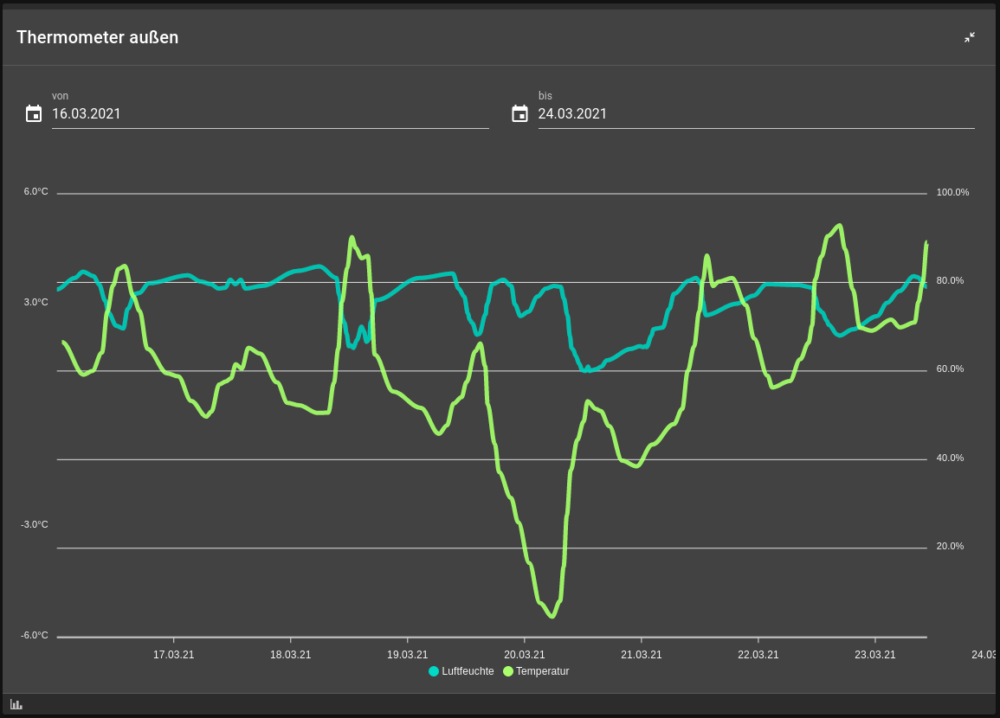*Beispiel für vergrößertes Chart*

#### Definition
Im FHEM-Device muss im Attribut `appOptions` folgendes eingetragen werden.
```
{ "template": "chart", "chartDef": ["<def1>", "<def2>", ...], "setup": { } }
```

### Konfiguration von Charts
Da *Chart* kein Standard-Template ist, könnt ihr nur ausgewählte Eigenschaften über den Parameter `setup` in `appOptions` anpassen. Über den Paramter `size` kann die Templatebreite [siehe](#breite-von-templates) verändert werden. Der Parameter `daysAgo` legt ihr fest, wieviele Tage das Chart beim Laden zurückschaut. Als Standard werden die Daten der letzten 7 Tage `"daysAgo": 6` geladen. Über den Parameter `chartDef` legt ihr fest, welche Daten im Chart angezeigt werden. Jede Linie entspricht dabei einer Definition.
```
"chartDef": ["logsource:reading:text:präfix:axis:color:min:max:typ:lineWidth:markers"],
"setup": {
    "size": "string",
    "daysAgo": number
}
```
1. **logsource** - dieser Parameter enthält entweder den Name des *FileLog-Devices* oder den Name eures *DbLog-Devices*.
2. **reading** - wenn ihr auf ein *FileLog-Device* zugreift, genügt hier im Normalfall der Name des *Readings* welches dargestellt werden soll. Wenn euer *FileLog* Readings in mehreren Spalten enthält, dann müsst ihr den Parameter in runde Klammern setzen und *<spalte:reading>* angeben z.B. `(4:temperature)`. Wenn Daten von einem *DbLog-Device* anzeigen wollt, dann müsst ihr den Parameter in runde Klammern setzen und *<device>:<reading>* angeben z.B. `(myTempSensor:temperature)`
3. **text** - hier tragt iht den gewünschten Achsenname ein. (z.B. Temperatur)   
4. **präfix** - hier tragt ihr die Einheit der Werte ein. (z.B. °C)
5. **axis** - wenn dieser Parameter weggelassen wird, dann bezieht sich die Linie im Chart auf die linke Achse. Tragt ihr hier **secondary** ein, so bezieht sich die Linie im Chart auf die rechte Achse. Das ist z.B. sinnvoll, wenn ihr in einem Chart die Temperatur und die Luftfeuchte auf unterschiedlichen Skalen anzeigen wollt. Wenn kein Achsenlabel angezeigt werden soll dann könnt ihr zusätzlich **no-label** eintragen.
6. **color** - hier könnt ihr (optional) die Farbe der Linie definieren. Wenn dieser Parameter angegeben wird, dann muss dieser für alle Linien in dieser Chartdefinition angegeben werden!
7. **min** - mit diesem Parameter kann (optional) der niedrigste Wert für die Y-Achse festgelegt werden. *(Standard = auto)*
8. **max** - mit diesem Parameter kann (optional) der höchste Wert für die Y-Achse festgelegt werden. *(Standard = auto)*
9. **typ** - mit diesem Parameter kann (optional) die Diagrammart festgelegt werden. *(Standard = line)*
10. **lineWidth** - mit diesem Parameter kann (optional) die Linienbreite festgelegt werden. *(Standard = 4)*
11. **markers** - mit diesem Parameter kann (optional) die Größe von Datenpunkten festgelegt werden. *(Standard = 0)*

### Diagrammarten
Es stehen folgende Arten zur Verfügung *line* (Standard), *stepline*, *column*, *area*  

| Hinweis: Wenn ihr eure Daten über *DbLog* erfasst, dann habt ihr in FHEM dafür im Normalfall nur ein Device angelegt. Damit ihr verschiedene Charts in **FHEMApp** anzeigen könnt, empfielt es sich, je Chart ein *dummy* in FHEM anzulegen und hier die entsprechenden `appOptions` für das Chart zu hinterlegen. Wenn ihr eure Daten in einzelnen *FileLog-Dateien* erfasst, dann könnt ihr `appOptions` an dem jeweiligen *FileLog-Device* hinterlegen.

### Beispiel für eine Chartkonfiguration
Es wird ein Chart im Menüpunkt *Dashboard* angezeigt. Aus dem Logfile werden die Readings *humidity* (rechte Achse) und *measured-temp* (linke Achse) im Chart dargestellt.
```
define chn_sen.hm.eg.fl_Climate_FileLog FileLog ./log/chn_sen.hm.eg.fl_Climate.log heat.hm.eg.fl:pct:.*|chn_sen.hm.eg.fl_Climate:humidity:.*|chn_sen.hm.eg.fl_Climate:measured-temp:.*
attr chn_sen.hm.eg.fl_Climate_FileLog alias Thermostat Flur
attr chn_sen.hm.eg.fl_Climate_FileLog appOptions { "template": "chart", "dashboard": "true", "chartDef": [":humidity:Luftfeuchte:%:secondary",":measured-temp:Temperatur:°C"] }
attr chn_sen.hm.eg.fl_Climate_FileLog sortby 2
```
# Template Cam
Dieses Template steht speziell für die Wiedergabe von Videostreams zur Verfügung.

#### Definition
Im FHEM-Device muss im Attribut `appOptions` folgendes eingetragen werden.
```
{ "template": "cam", "setup": { "source": "<stream_url>" } }
```

#### Konfiguration
Da *Cam* kein Standard-Template ist, könnt ihr nur ausgewählte Eigenschaften über den Parameter `setup` in `appOptions` anpassen. Folgende Eigenschaften könnt ihr individuell anpassen:
```
"setup": {
  "size": "col-12 col-md-6 col-lg-6",
  "source": "<stream_url>"
  "status": {
    "bar": ["reading:value:level:color"]
  },
  "info": {
    "left1": ["reading:value:text:icon"],
    "left2": ["reading:value:text:icon"],
    "mid1": ["reading:value:text:icon"],
    "mid2": ["reading:value:text:icon"],
    "right1": ["reading:value:text:icon"],
    "right2": ["reading:value:text:icon"],
  }
}
```

# Template scenes
Dieses Template steht speziell für den Einstz von *LightScene* [siehe](https://fhem.de/commandref_DE.html#LightScene) zur Verfügung. Es zeigt die aktuelle Szene an und gibt die Möglichkeit zwischen den in FHEM gespeicherten Szenen umuzschalten.
#### Definition
Im FHEM-Device muss im Attribut `appOptions` folgendes eingetragen werden.
```
{ "template": "scenes" }
```

#### Konfiguration
Da *Scenes* kein Standard-Template ist, könnt ihr nur ausgewählte Eigenschaften über den Parameter `setup` in `appOptions` anpassen. Folgende Eigenschaften könnt ihr individuell anpassen:
```
"setup": {
  "status": {
    "bar": ["reading:value:level:color"]
  },
  "main": [
    {
      "text": ["reading:value:text"]
    }
  ],
  "info": {
    "left1": ["reading:value:text:icon"],
  }
}
```
# Template Sysmon
Dieses Template steht speziell für den Einstz von *SYSMON* [siehe](https://fhem.de/commandref_DE.html#SYSMON) zur Verfügung. Es liefert diverse Informationen und Statistiken zu dem System, auf dem FHEM-Server ausgeführt wird.
#### Definition
Im FHEM-Device muss im Attribut `appOptions` folgendes eingetragen werden.
```
{ "template": "sysmon" }
```

#### Konfiguration
Da *sysmon* kein Standard-Template ist, könnt ihr nur ausgewählte Eigenschaften über den Parameter `setup` in `appOptions` anpassen. Über den Parameter `subTitle` könnt ihr einen Text z.B. den CPU Model Name anzeigen. Im Hauptteil des Templates können über den Parameter `main` beliebig viele Blöcke definiert werden. Jeder Block enthält einen **Name**, eine Definition für eine **Statusbar** (optional) und einen **Text** (optional) welcher unter dem Name bzw. unter der Statusbar angezeigt wird. Weiterhin könnt ihr über den Parameter `fhemBtns` festlegen ob die Buttons für ein Update von FHEM, für den Restart von FHEM und für die Anzeige des Systemprotokolls angezeigt werden sollen. Folgende Eigenschaften könnt ihr individuell anpassen:
```
"setup": {
  "status": {
    "bar": ["reading:value:level:color"],
    "error": ["reading:value:level:color:text"]
  },
  subTitle: ["reading:value:text"],
  "main": [
    {
      "name": string,
      "bar": ["reading:value:level:color:min:max"],
      "subText": ["reading:value:text"]
    }
  ],
  fhemBtns: true,
  "info": {
    "left1": ["reading:value:text:icon"],
    "left2": ["reading:value:text:icon"],
    "mid1": ["reading:value:text:icon"],
    "mid2": ["reading:value:text:icon"],
    "right1": ["reading:value:text:icon"],
    "right2": ["reading:value:text:icon"]
  }
}
```
### Beispiel für eine Sysmon-Konfiguration
In diesem Beispiel wird das Template im Menüpunkt *System* von **FHEMApp** angezeigt. Im Hauptteil des Templates werden 5 Blöcke angezeigt. Für die Blöcke CPU Auslastung, RAM Auslastung und CPU Temperatur wird zusätzlich eine Statusbar angezeigt. Weiterhin wurde in diesem Beispiel jeweils ein *userreading* für die CPU Auslastung und die RAM Auslastung in FHEM angelegt, da diese Readings nicht separat zur Verfügung standen.
```
define sysmon SYSMON 1 1 1 10
attr sysmon alias FHEM Server
attr sysmon appOptions { "template": "sysmon", "system": true, "setup": { "subTitle": ["cpu_model_name::%s"], "fhemBtns": true, "main": [ \
  { "name": "CPU Auslastung:", "bar": ["cpu_app::%n:success:0:100"], "subText": ["cpu_app::%n.1 %"] }, \
  { "name": "RAM Auslastung:", "bar": ["ram_app::%n:success:0:100"], "subText": ["ram_app::%n.1 %"] },\
  { "name": "CPU Temperatur:", "bar": ["cpu_temp::%n:success:0:100"], "subText": ["cpu_temp::%n.1 °C"] },\
  { "name": "Server läuft seit:", "subText": ["starttime_text::%s"] },\
  { "name": "FHEM läuft seit:", "subText": ["fhemstarttime_text::%s"] } \
] } }
attr sysmon network-interfaces enp3s0
attr sysmon sortby 1
attr sysmon userReadings cpu_app { 100 - (split ' ',ReadingsVal("$name", "cpu_idle_stat", 0))[2] }, ram_app { (split ' ',ReadingsVal("$name", "ram", 0))[6] }
```
