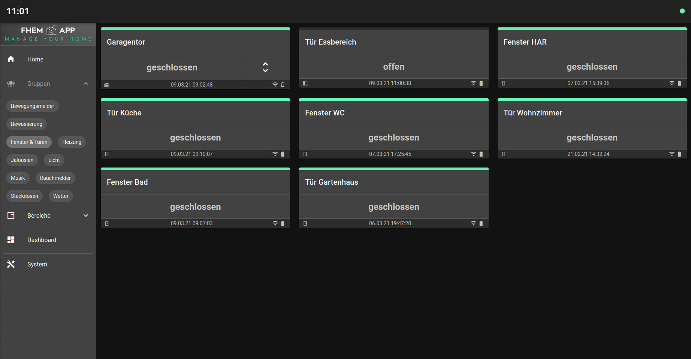

# FHEM App
**FHEMApp** ist eine Web-Application zur Steuerung deiner Smarthome Umgebung. Sie wurde als Frontend für den gemeinsamen Einsatz von FHEM(tm) entwickelt. **FHEMApp** ist für den Betrieb auf unterschiedlichen Geräten (responsives design) ausgerichtet. Die Elemente zur Steuerung der verschiedenen SmartHome-Geräte (Aktoren/Sensoren) sind auf eine sehr einfache und intuitive Bedienung ausgelegt. Für die Einrichtung von **FHEMApp** sind keine Programmierkenntnisse erfordlerlich. **FHEMApp** wird komplett über FHEM konfiguriert.  

*Beispiel für eine Startseite in der Desktopansicht*

*Beispiel für Geräte in der Desktopansicht*

*Beispiel die App in der Smartphoneansicht*

# Systemanforderungen
Für den Betrieb wird FHEM (als Backend) und ein Web-Server für **FHEMApp** (Frontend) benötigt.
* Backendsystem - FHEM https://fhem.de/
* Webserver - z.B. Apache https://httpd.apache.org/

# Installation
Für den Betrieb der **FHEMApp** müssen alle Dateien und Unterverzeichnisse aus dem Ordner [www/fhemapp](./www/fhemapp) auf das Arbeitsverzeichnis des Webservers kopiert werden. Andere Verzeichnisse und Dateien sind nicht für den Betrieb der App notwendig.

# Konfiguration der Web-Application
Die initiale Konfiguration von **FHEMApp** erfolgt über die Datei `config.json` welche sich im Verzeichnis [www/fhemapp/cfg](.www/fhemapp/cfg) befindet. Die Konfigurationsdatei könnt ihr über einen normalen Texteditor bearbeiten. Beachtet bei der Veränderung der Konfiguration auf die richtige Schreibweise im *JSON-Format*.

### Verbindungseinstellung für FHEM
Unter *connection* könnt ihr den `Serverort`, den `Port` sowie den `Pfad` eurer FHEM Installation angeben. Standardmäßig ist **FHEMApp** auf die folgenden Verbindungseinstellungen konfiguriert.

```
"connection": {
  "location": "http://fhem",
  "port": "8083",
  "path": "fhem"
},
```

### Performanceeinstellungen für FHEMApp
Unter *options* könnt ihr die maximale Anzahl der `Chartpunkte` reduzieren, falls die Darstellung von Grafiken zu lange dauert. Das kann bei Betrieb von FHEM auf kleineren Systemen sinnvoll sein. Über den `Log-Puffer` könnt ihr die Anzahl der Logeinträge reduzieren, die **FHEMApp** zwischenspeichert. Dies ist nur für die Fehleranalyse notwendig.

```
"options": {
  "maxChartPoints": 100,
  "logBuffer": 500
},
```

### Themeneinstellungen für FHEMApp
Unter *theme* könnt ihr das farbliche Layout von **FHEMApp** individuell anpassen. Grundsätzlich könnt ihr zwischen einem *dunklen* und einem *hellen* Layout über den Parameter `dark` wechseln. Weiterhin könnt ihr das *dunkle* bzw. das *helle* Layout über die Definitionen unter den Parametern `light` bzw. `dark` individuell verändern. Welche Parameter ihr hier verwenden könnt, ist hier [Vuetify Customizing](https://vuetifyjs.com/en/features/theme/#customizing) beschrieben.    

```
"theme": {
  "dark": true,
  "light": {
    "primary": "#F48FB1"
  }
}
```

# Konfiguration in FHEM
