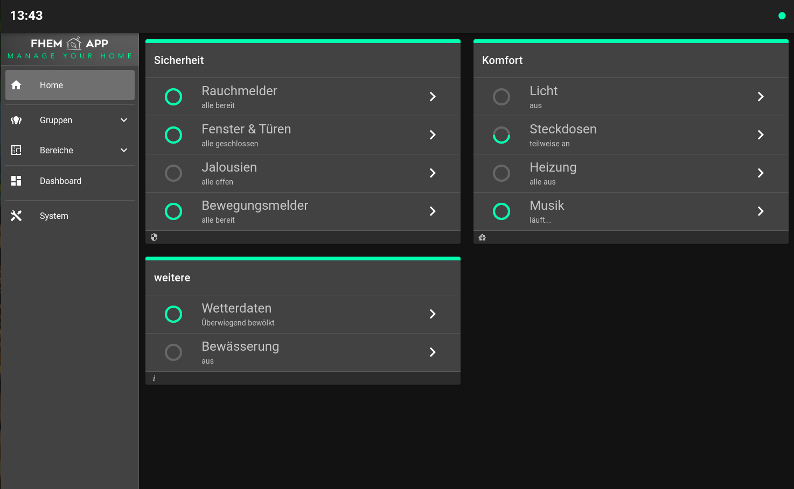

# FHEM App
Web-Application zur Steuerung deiner Smarthome Umgebung.

*Beispiel für eine Startseite in der Desktopansicht*

# Systemanforderungen
Für den Betrieb wird FHEM (als Backend) und ein Web-Server für die Web-Application (Frontend) benötigt.
* Backendsystem - FHEM https://fhem.de/
* Webserver - z.B. Apache https://httpd.apache.org/

# Installation
Für den Betrieb der **FHEMApp** müssen alle Dateien und Unterverzeichnisse aus dem Ordner [www/fhemapp](./www/fhemapp) auf das Arbeitsverzeichnis des Webservers kopiert werden. Andere Verzeichnisse und Dateien sind nicht für den Betrieb der App notwendig.

# Konfiguration in FHEM

# Konfiguration der Web-Application
