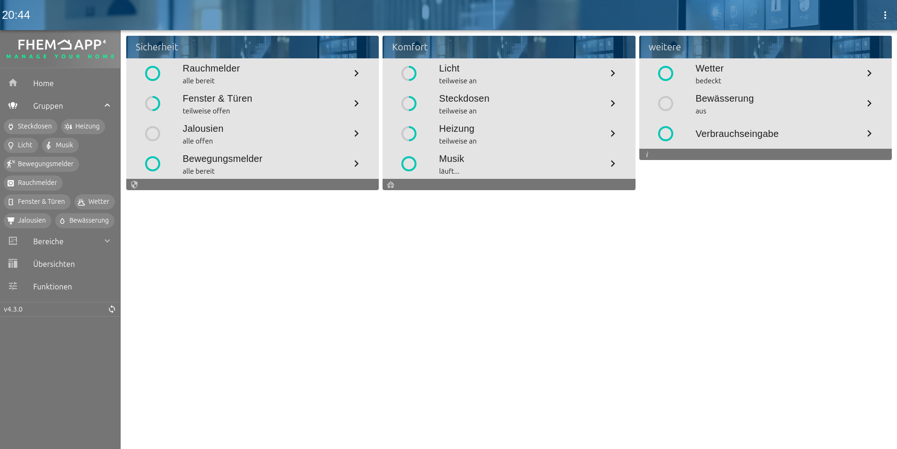
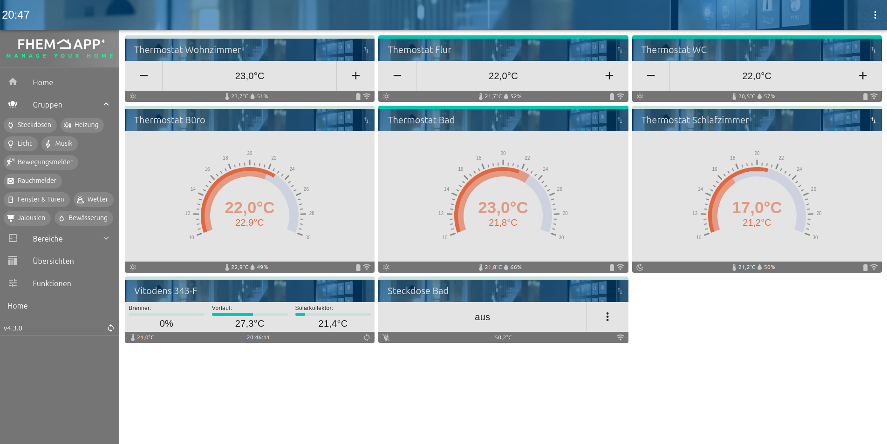
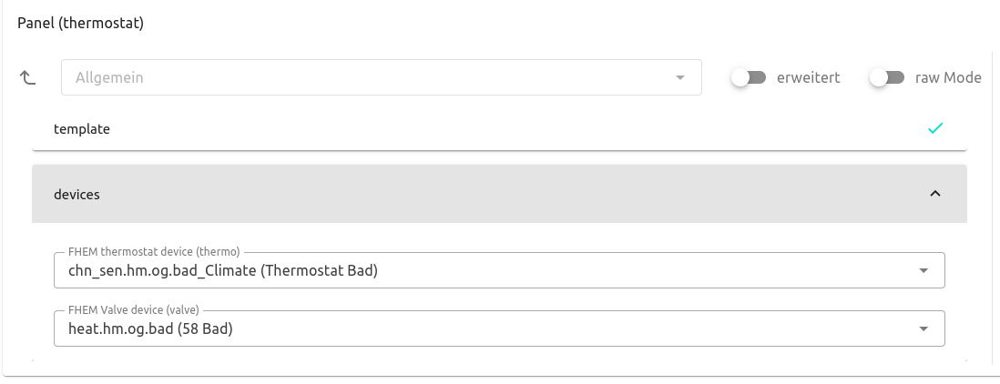
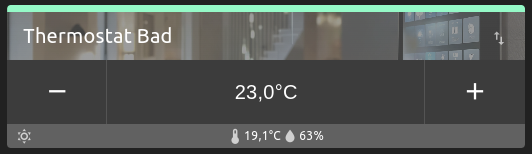

# FHEMApp
**FHEMApp** ist eine Web-Application zur Steuerung deiner Smarthome Umgebung. Sie wurde als Frontend für den Einsatz unter FHEM(tm) entwickelt. **FHEMApp** ist für den Betrieb auf unterschiedlichen Betriebssystemen und Geräten optimiert. **FHEMApp** kann sehr einfach konfiguriert werden, ohne das dafür Programmierkenntnisse erforderlich sind.

*Beispiel für eine Startseite in der Desktopansicht*

*Beispiel für Geräte in der Desktopansicht*

*Beispiel für Grafiken in der Desktopansicht*

*Beispiel für dunkles Farbschema in der Desktopansicht*

*Beispiele für mobile Ansicht*

*Beispiele für mobile Ansicht*

*Beispiel für Einstellungen*

*Beispiel für Konfiguration von Templates*

*Beispiel für Konfiguration von Templates mit Assistent*

*Beispiel für Konfiguration von Sprachvariablen*

*Beispiel für Konfiguration von allgemeinen Einstellungen*

*Beispiel für Konfiguration von Navigationselementen*

# Systemanforderungen
Für den Einsatz von **FHEMApp** wird FHEM(tm) benötigt. Weitere Informationen zu FHEM findest du unter https://fhem.de/
# Installation und Updates
Die Installation von **FHEMApp** erfolgt in FHEM. Hierfür erstellst du in FHEM über den folgenden Befehl ein *fhemapp*-Device. 

```
define myapp fhemapp fhemapp4
```
Das *fhemapp*-Device ist für das Laden und Speichern der Konfigurationsdaten von **FHEMApp** zuständig und dient zudem für die Installation und Updates von **FHEMApp**. 

Bei der Installation wird automatisch ein neuer Ordner in deiner FHEM Installation unter */opt/fhem/www/* erstellt. In diesem wird **FHEMApp** installiert. Weiterhin wird in deiner FHEM Installation unter */opt/fhem/conf/* eine Konfigurationsdatei abgelegt, die alle Einstellungen enthält. Für jedes *fhemapp*-Device wird dabei eine separate Konfigurationsdatei erstellt. Diese erthält den Name des *fhemapp*-Devices (z.B. *myapp*_config.fhemapp)

# Instanzen
In FHEM können mehrere *fhemapp*-Devices definiert werden. Hinter jedem Device wird eine separate Konfiguration gespeichert. Dies ermöglicht die Betrieb von beliebig vielen **FHEMApp**-Instanzen. Beim Aufruf von **FHEMApp** kann dann auf die jeweilige Instanz verwiesen. 

<br>*Beispiel für zwei unterschiedliche FHEMApp-Instanzen in FHEM*

# Aufruf
Der Aufruf von **FHEMApp** erfolgt grundsätzlich über die gleiche URL, über die auch FHEM erreichbar ist. Die URL muss wie folgt aufgebaut sein, damit die richtige Installation und Instanz von **FHEMApp** aufgerufen wird.
```
http(s)://<fhem_ip>:<fhem_port>/fhem/<fhemapp_verzeichnis>/index.html#/<fhemapp_instanz>
```
Beispiel zum Aufruf von FHEMapp
```
http://fhem:8083/fhem/fhemapp4/index.html#/myapp
```
Wenn **FHEMApp** auf einem separaten Web-Server betrieben wird, dann muss die URL mit `#/<fhem_instanz>` enden.
## zusätzliche URL-Parameter
Es können zusätzliche Parameter als Querystring in der URL angegeben werden.
Diese sind u.a. beim Betrieb von **FHEMApp** auf einem separaten Web-Server nötig. 

> [!IMPORTANT]
> Beim Betrieb von **FHEMApp** auf einem separaten Web-Server müssen die Verbidungsparameter `protocol`, `server`, `port` und `path` angegeben werden!

|Parameter|Beschreibung|Beispiel|
|---|---|---|
|protocol|WEB Protokoll über das FHEM erreichbar ist|http oder https|
|server|url bzw. IP-Adresse unter der FHEM erreichbar ist|fhem|
|port|Port über den FHEM erreichbar ist|8083|
|path|Pfad der FHEM Installation|fhem|
|dark|Festlegen ob **FHEMApp** im dunklen Farbschema geöffnet wird (siehe auch [Farbschema](#farbschema))|1
|lang|Sprache in der **FHEMApp** geöffnet wird|de, en, ...|
|xhr|Umschaltung auf Longpoll wenn Browser kein websocket unterstützt|1|
|loglevel|Detailgrad der Protokollierung für Fehleranalyse über die Browserkonsole. Ab dem loglevel 7 wird die Kopfzeile von **FHEMApp** umgeschaltet und ein Infosymbol angzeigt. Bei Klick auf das Infosymbol werden weitere Systeminformationen von **FHEMApp** angezeigt. (*1=status, 2=error, 3=warnings, 4=infos, 5=all request to fhem, 6=received events from fhem, 7=details, 8=all received events from FHEM*)|1...8|

Beispiel zum Aufruf von FHEMapp mit zusätzlichen Parametern
```
http://fhem:8083/fhem/fhemapp4/index.html#/myapp/?dark=1&lang=en
```
# Einstellungen
Für die Konfiguration deiner **FHEMApp**-Instanz(en) bietet die App einen separaten Bereich, in dem alle Einstellungen vorgenommen werden können. Nach dem Erstellen einer neuen Instanz gelangst du beim ersten Aufruf von **FHEMApp** direkt zu den Einstellungen.

Für den späteren Zugriff auf die Einstellungen kann man den Menüpunkt im [Optionsmenü](#optionsmenü) aktivieren. Alternativ kann man auch direkt über den entsprechenden URL-Pfad `...<fhemapp_instanz>/settings/` auf die Einstellungen zugreifen.

Nachdem du Einstellungen in **FHEMApp** angepasst hast, müssen diese gespeichert werden. Dies erfolgt über den Button zum Speichern oben rechts im Einstellungsfenster. Hier kannst du Änderungen seit dem letzten Speichern auch wieder rückgängig machen.

*Beispiel für Einstellungen*

# Allgemeine Einstellungen

## Kopfzeile
In den Einstellungen für die Kopfzeile kann die Anzeige für das Datum und die Uhrzeit vom FHEM Server in der Desktopansicht aktiviert werden. Es kann das Navigationsmenü in der Desktopansicht optional ausgeblendet werden und die Anzeige der aktuellen Seite für die mobile Ansicht aktiviert werden. Weiterhin kann ein Hintergrundbild für die Kopfzeile festgelegt werden. Die Verwendung des Farbfilters mit einer [CSS Linear Gradient Definition](https://www.w3schools.com/css/css3_gradients.asp) ermöglicht ein Anpassung des Hintergrundbildes an das festgelegte Farbschema. 

## Farbschema
In **FHEMApp** werden zwei Farbschemen (dunkel und hell) unterstützt. Die einzelnen Farben können für beide Farbschemen wie im Abschnitt [Farben](#farben) beschrieben, angepasst werden. Beim Öffnen von **FHEMApp** wird das Farbschema (dunkel bzw. hell) aus den Einstellungen des Browsers bzw. des Betriebssystems verwendet. Zusätzlich kann das Farbschema wie folgt gesteuert werden.
1. über den URL-Parameter `dark` (siehe auch [zusätzliche URL-Parameter](#zusätzliche-url-parameter))
2. über ein FHEM Reading
3. über das Optionsmenü (siehe auch [Optionsmenü](#optionsmenü))

Wenn das Farbschema über den **URL-Parameter** `dark` festgelegt wird, dann wird **FHEMApp** in diesem geöffnet und die Browsereinstellung bzw. Betriebssystemeinstellung ignoriert.

Wenn das Farbschema über ein **FHEM Reading** gesteuert wird, dann wird die Browerseinstellung bzw. Betriebssystemeinstellung und (sofern festgelegt) der URL-Parameter `dark` ignoriert. Jede Änderung des FHEM Reading hat dann eine Umschaltung aller gerade geöffneten **FHEMApp's** zur Folge. Das festgelegte FHEM Reading wird auf seinen Wahrheitswert geprüft. Wenn dieses zutrifft, dann wird **FHEMApp** in das dunkle Farbschema geschaltet. Ansonsten wird **FHEMApp** in das helle Farbschema geschaltet.

|Parameter|Beschreibung|
|---|---|
|reading|siehe Parameter [reading](#konfiguration-der-elemente)|
|value|siehe Parameter [value](#konfiguration-der-elemente)|

Die Umschaltung des Farbschema über das **Optionsmenü** kann zur Laufzeit immer erfolgen, wird jedoch nicht gespeichert.

## Startseite
Beim Starten von **FHEMApp** kann eine bestimmte Seite aus dem Navigationsmenü geöffnet werden. Diese Seite wird jedoch nur dann angezeigt, wenn die URL beim Aufruf von **FHEMApp** keinen Verweis auf eine bestimmte Seite (z.B. `...#/myapp/devices/Räume->Wohnzimmer...`) enthält.

## Optionsmenü
Durch Aktivierung der folgenden Optionen wird das Optionsmenü oben rechts in der Kopfleiste eingeblendet.

*Beispiel für Optionsmenü*

|Option|Beschreibung|
|---|---|
|Tag/Nacht-Modus|Umschaltung zwischen hellem und dunklem Farbschema|
|Seite aktualisieren|Neuladen von **FHEMApp** auslösen. Diese Option ist im Normalfall nicht nötig. Sie kann jedoch im Einzelfall helfen, wenn Panels bei Longpoll-verbindungen nicht aktualisiert werden|
|Einstellungen|Aktiviert direkten Zugriff auf die Einstellungen von **FHEMApp** über das Optionsmenü|
|Updates|der Punkt "Aktualisierung" wird angezeigt, sobald ein Update für **FHEMApp** verfügbar ist. Die Funktion prüft das Reading `update_available`. Damit sind Updates von FHEMApp einfach und direkt über FHEMApp möglich. Nachdem ein Update ausgeführt wurde, wird automatisch auch ein Reload von **FHEMApp** ausgeführt|
|Sprachen|ermöglicht die Umstellung der Sprache. Siehe hierzu auch den Abschnitt [Sprachen](#sprachen)|

## Optionsmenü FHEM Befehle
Neben den festen Optionen können im Optionsmenü auch FHEM Befehle hinterlegt werden. Es können beliebig viele FHEM Befehle im Optionsmenü hinterlegt werden. Jeder Befehl kann mit einer individuellen Beschriftung und optional mehrsprachig (siehe auch [Sprachen](#sprachen)) sowie mit einem Icon versehen werden. Zudem muss das vollständige FHEM-Kommando angegeben werden.  

# Panels
Alle Geräte die du in FHEM eingebunden hast, können innerhalb von **FHEMApp** in Panels angezeigt und gesteuert werden. Jedes Panel enthält drei **Bereiche**. Jeder Bereich enthält verschiedene **Elemente**. Jedes Element kann mit *Readings*, *Attributes* oder *Internals* von FHEM Devices verknüpft und abhängig von deren Werten gesteuert werden. Konfigurationen können auch als [Vorlagen](#vorlagen) gespeichert und für mehrere Panels verwendet werden. Panels können in beliebigen Gruppen (z.B. nach Räumen oder Geräteart) zusammengefasst und dann über die Navigationsleiste zur Anzeige gebracht werden.

* Bereich [status](#bereich-status) im oberen Teil des Panels
* Bereich [main](#bereich-main) im mittleren Teil des Panels
* Bereich [info](#bereich-info) im unteren Teil des Panels


<br>*Beispiel für ein Panel*

## neues Panel erstellen
Über die Einstellungen in **FHEMApp** kannst du neue Panels erstellen. Nachdem du ein **neues Panel** mit einem **eindeutigem Name** erstellt hast, wählst du eine passende [Vorlage](#vorlagen) aus und verbindest das Panel mit mindestens einem FHEM Device. Je nach Vorlage kann es auch sein, dass du mehrere FHEM Devices verbinden musst.


<br>*Beispiel für die Definition von Devices in einem Panel*

Alternativ kannst du ein Panel auch ohne Verwendung einer Vorlage (Template) konfigurieren. Hier musst du die **erweiterte Ansicht** aktivieren und kannst nur alle Elemente des Panels manuell konfigurieren.

Wenn du bei Verwendung einer Vorlage einzelne Elemente nur für das aktuelle Panel anpassen möchtest, kannst du ebenfalls die **erweiterte Ansicht** aktivieren. 

## Konfiguration der Elemente
Die Konfiguration der Elemente in den verschiedenen Bereichen des Panels erfolgt nach einem einheitlichen Definitions-Schema. 
`reading:value:prop1:prop2:...`

Jede Definition beginnt mit den beiden Parametern `reading` und `value`. Diese dienen dazu, das Element mit einem FHEM-Device zu verbinden und optional auf einen bestimmten Wert zu prüfen. Folgende Beispiele zeigen, wie der Parameter `reading` verwendet werden kann. 

|Beispiel|Beschreibung|
|---|---|
|`state`|liefert das FHEM **Reading** `state`|
|`state-ts`|liefert den **Zeitstempel** des FHEM Readings `state`|
|`a-alias`|liefert das FHEM **Attribut** `alias`|
|`i-NAME`|liefert das FHEM **Internal** `NAME`|

Wenn ein Panel mit mehreren FHEM-Devices verbunden wird, dann muss der Schlüssel für das Device vorangestellt werden.

|Beispiel|Beschreibung|
|---|---|
|`valve-state`|liefert das FHEM **Reading** `state` vom Device das mit dem Schlüssel `valve` im Panel definiert ist|
|`thermo-measured-temp-ts`|liefert den **Zeistempel** für das FHEM Reading `measured-temp` vom Device das mit dem Schlüssel `thermo` im Panel definiert ist.|

Eine Definition wird verwendet, wenn der Parameter `value` zutrifft. Bei der Prüfung wird grundsätzlich zwischen Zahlen und Text unterschieden. Bei Zahlen gilt immer **reading >= value**. Bei Text wird geprüft, ob dieser **im Reading enthalten** ist. Weiterhin können Definitionen mit Hilfe von [regular expression](https://regex101.com/) geprüft werden.

|Beispiel|Beschreibung|
|---|---|
|`temperature:12:...`|trifft zu wenn das *Reading* **größer oder gleich** *12* ist|
|`state:on:...`|trifft zu wenn das *Reading* den Text `on` **enthält**|
|`state:^on:...`|triff zu wenn das *Reading* mit dem Text `on` **beginnt**|
|`state:^(?!on):...`|trifft zu wenn das *Reading* **nicht** den Wert `on` hat|
|`state::...`|Es erfolgt **keine weitere Prüfung**. die Definition wird verwendet.|

Wenn ein Element mehrere Definitionen enthält, dann wird immer die erste zutreffende Definition verwendet. Nachfolgende Definitionen werden ignoriert. Deshalb muss die Reihenfolge der Definitionen beachtet werden. 


<br>*Beispiel für eine Element Definition*

Folgende Schreibweisen sind für Definitionen zulässig.
Im folgenden Beispiel wurde das Panel mit zwei FHEM Devices `temp:thermostat_wohnen` und `valve:heizung_wohnen` verbunden.  

|Definition|Erklärung|
|---|---|
|`state::...`|Wird dem Reading kein Device vorangestellt, so wird immer das erste im Panel definierte Device verwendet.|
|`temp-state::...`|Es wird das Device verwendet, welches dem Reading vorangestellt ist.|
|`::text:mdi-check`|Das Element wird mit keinem Reading verbunden und es werden zwei Parameter für das Element übergeben|
|`true`|Das Element wird mit keinem Reading verbunden und für den erste Parameter der Definition wird der Wert `true` übergeben

## Ersetzungen
Ersetzungen bieten die Möglichkeit, Werte innerhalb von Element-Definitionen zurückzugeben und zu formatieren. Folgende Möglichkeiten für Ersetzungen gibt es.
|Ersetzung|gibt den Wert vom Parameter `reading`|
|---|---|
|%s|als Text zurück|
|%n()|als Ganzzahl zurück|
|%n(2)|als Zahl mit 2 Nachkommastellen zurück|
|%n(0,1)|als Ganzzahl mit einem **Offset** von +1 zurück|
|%n(1,-1.5)|als Zahl mit einer Nachkommastelle und einem **Offset** von -1,5 zurück|
|%d()|als Zeitstempel im gewählten Sprachschema zurück|
|%d(time)|als Zeitwert im gewählten Sprachschema zurück|
|%d(date)|als Datum im gewählten Sprachschema zurück|
|%d({ "weekday"\\: "long" })|als Wochentag im gewählten Sprachschema zurück (siehe auch [Datumsformatierung](https://www.w3schools.com/jsref/jsref_tolocalestring.asp))|
|%d({ "diff"\\: {...} })|als Differenz zur FHEM Serverzeit zurück|

|Ersetzung|Beschreibung|
|---|---|
|%t(`val`)|gibt die Übersetzung für `val` an. (siehe auch [Sprachen](#sprachen))|
|%r(`val`,`search`,`replace`)|sucht in `val` nach `search` und ersetzt alle Vorkommen durch `replace`|
|%v|liefert den aktuellen Wert von Slidern oder Menüeinträgen
|\\:|wird zur Ausgabe von `:` innerhalb von Element-Definitionen verwendet|

|Beispiel|Reading|Ausgabe|Hinweis|
|---|---|---|---|
|`state::%s`|on|on|
|`temperature::%n(0)`|12.5|13|
|`desired-temp::%n(1,2)`|22.5|24,5|Komma und tausender Trennzeichen abhängig vom Sprachschema|
|`state-ts::%d()`|2023-12-17 17:53:32|17.12.2023 17:53:32|abhängig vom Sprachschema|
|`state-ts::%d(time)`|2023-12-17 17:53:32|17:53:32|abhängig vom Sprachschema|
|`state-ts::%d(date)`|2023-12-17 17:53:32|17.12.2023|abhängig vom Sprachschema|
|`state-ts::%d({ "weekday"\: "long" })`|2023-12-17 17:53:32|Sonntag|abhängig vom Sprachschema|
|`state-ts::%d({ "diff"\: { "days"\: "nozero", "hours"\: "numeric", "minutes"\: true, "seconds"\: true, "daysSuffix"\: " Tag(e) ", "hoursSuffix"\: "\:", "minutesSuffix"\: "\:", "secondsSuffix"\: " " } })`||10 Tag(e) 8:07:34|auf korrekte JSON Notation achten und Doppelpunkte escapen|
|`state::%t(%s)`|on|an|wenn unter [Sprachen](#sprachen) für die Variable `on` im deutschen Sprachschema `an` hinterlegt wurde|
|`state::%r(%s,_, )`|alle_offen|alle offen|ersetzt alle Unterstriche durch Leerzeichen|
|`temp::Temperatur\: %n(1)°C`|18.7|Temperatur: 18,7°C|
## Panel allgemein
In den allgemeinen Einstellungen für Panels wird festgelegt, ob eine **Vorlage** zur Darstellung des Panels verwendet werden soll und mit welchen FHEM **Devices** das Panel verknüpft ist. Weiterhin wird festgelegt, unter welchen Navigationspunkten das Panel zur Anzeige gebracht werden soll. Zusätzlich können verschiedene Einstellung zur Darstellung des Panels erfolgen.

Wenn für ein Panel keine [Vorlage](#vorlagen) verwendet werden soll, oder bestimmte Einstellungen der Vorlage für das Panel angepasst werden sollen, kann die **erweiterte Ansicht** aktiviert werden.

### Element deviceskeys
Die *devicekeys* werden in [Vorlagen](#vorlagen) definiert. Ein *devicekey* ist eine Variable, welche in einer Vorlage (Template) an Stelle eines konkreten FHEM-Devicenamen verwendet wird. Bei der späteren Verwendung der Vorlage, wird in der Panelkonfiguration jeder *devicekey* einem konkreten FHEM-Device zugeordnet.

Somit können [Vorlagen](#vorlagen) für beliebig viele Panels verwendet werden. Die Defintion für einen Button, der einen bestimmten Befehl an FHEM sendet wird dann beispielsweise in Form von `set switch on` statt `set <fhem_device_name> on` in der betreffenden Definition hinterlegt. Die Variable `switch` wird dabei als *devicekey* definiert und später in der Panelkonfigurtation mit dem tatsächlichen FHEM-Device `<fhem_device_name>` verknüpft.

Für jede Vorlage muss mindestens ein *devicekey* festgelegt werden.

|Parameter|Beschreibung|
|---|---|
|key|eindeutiger Schlüssel, der für Element-Definitionen an Stelle von festen FHEM-Devicenamen verwendet werden soll|
|description|kurze Beschreibung des jeweiligen FHEM Devicetypen|

### Element devices
Liste der FHEM-Devices, die mit dem Panel verknüpft sind. Es muss mindestens ein FHEM-Device mit einem Panel verknüpft werden. (siehe auch [neues Panel erstellen](#neues-panel-erstellen))

|Parameter|Beschreibung|
|---|---|
|key|eindeutiger Schlüssel, der für Element-Definitionen benötigt wird|
|device|Name des FHEM Device, mit dem das Panel verknüpft ist|
### Element template
Optional kann eine [Vorlage](#vorlagen) ausgewählt werden, die für die Darstellung des Panels verwendet werden soll. Elemente die im Panel (unter **erweiterte Ansicht**) definiert wurden, behalten ihre Gültigkeit auch wenn eine Vorlage verwendet wird. In diesem Fall werden die betreffenden Definitionen aus der Vorlage ignoriert. 
### Element navigation
Liste der Navigationspunkte, unter denen das Panel angezeigt wird. Im Gegensatz zu normalen Definitionen, werden hier **alle** Definitionen verwendet, deren Bedingungen zutreffen.  

|Parameter|Beschreibung|
|---|---|
|reading|siehe Parameter [reading](#konfiguration-der-elemente)|
|value|siehe Parameter [value](#konfiguration-der-elemente)|
|route|Navigationspunkt unter dem das Panel angezeigt werden soll. Die Angabe kann auf gleiche Weise wie im FHEM-Attribut [room](https://wiki.fhem.de/wiki/Room) erfolgen.

|Beispiel|Beschreibung|
|---|---|
|`::home`|Das Panel wird im Navigationsmenü unter dem Menüpunkt `home` angezeigt|
|`::groups->Licht`|Das Panel wird im Navigationsmenü innherhalb von `groups` unter `Licht` angezeigt|
|`::groups->Licht,rooms->Arbeiten`| Das Panel wird im Navigationsmenü unter `groups` und unter `rooms` in den jeweiligen Untergruppen `Licht`bzw. `Arbeiten` angezeigt.|
|`a-room::rooms->%s`|Das Panel wird im Navigationsmenü innerhalb von `rooms` unter dem Name angezeigt, der im zugeordneten FHEM Device im Attribut *room* hinterlegt ist.| 

### Element expandable
Panels können ausgeklappt werden sobald mehr als eine aktive Ebene im Bereich [main](#bereich-main) enthalten. Weiterhin kann festgelegt werden, ob das Panel beim Laden bereits ausgeklappt sein soll und ob das Panel auf die voll Bildschirmgröße maximiert werden kann.

|Parameter|Default|Beschreibung|
|---|---|---|
|reading||siehe Parameter [reading](#konfiguration-der-elemente)|
|value||siehe Parameter [value](#konfiguration-der-elemente)|
|expandable|false|soll ausklappbar sein [boolean]|
|expanded|false|ist beim Laden ausgeklappt [boolean]|
|maximizable|false|kann auf volle Bildschirmgröße maximiert werden [boolean]|

## Element popout
Panels können als Popup angezeigt werden, sobald ein FHEM Reading einen bestimmten Wert hat. Beim Schließen des Popup kann optional ein FHEM Kommando gesendet werden.

|Parameter|Default|Beschreibung|
|---|---|---|
|reading||siehe Parameter [reading](#konfiguration-der-elemente)|
|value||siehe Parameter [value](#konfiguration-der-elemente)|
|show|false|soll ausklappbar sein [boolean]|
|width|400px|legt die Breite des Popup in 'px' oder '%' fest [string]|
|cmd|| FHEM Kommando [string]|

### Element sortby
Panels können in einer bestimmten Reihenfolge angezeigt werden. Hierfür kann ein beliebiger Sortierschlüssel festgelegt werden. Panels mit Sortierschlüssel werden immer zuerst angezeigt. Danach folgen alle Panels ohne Sortierschlüssel.

|Parameter|Default|Beschreibung|
|---|---|---|
|reading||siehe Parameter [reading](#konfiguration-der-elemente)|
|value||siehe Parameter [value](#konfiguration-der-elemente)|
|sortkey||Sortierschlüssel [string \| number]|
### Element show
Panels können ausgeblendet werden.

|Parameter|Default|Beschreibung|
|---|---|---|
|reading||siehe Parameter [reading](#konfiguration-der-elemente)|
|value||siehe Parameter [value](#konfiguration-der-elemente)|
|show|true|blendet Panel ein oder aus [string \| number]|
### Element iconmap
Wenn innerhalb eines Panels viele unterschiedliche Icons mehrfach zum Einsatz kommen und diese zudem abhängig von *readings* sind, können Elementdefinitionen sehr groß werden. Hierfür kann das Mapping für Icons verwendet werden. Dazu kann eine Liste von Variablen erstellt und jeder Variable ein Icon zugewiesen werden. 

Bei Verwendung des Mapping kann in allen Elementen, in denen Icons definiert werden können, die Variable statt dem Icon-Name verwendet werden. 

Die Variable ist auch als Suchtext zu verstehen. Wenn beispielsweise in einem Wetter-Template ein *reading* verwendet werden soll, um verschiedene Wetterlagen als Icon darzustellen, kann der Wert des *readings* entsprechend geprüft werden. 

**Beispiel:** reading = `morgens stark bewölkt` - Definition = `stark bewölkt:mdi-weather-partly-cloudy`. Es wird nach *stark bewölkt* im Wert des *readings* gesucht und wenn dieser Text enthalten ist, dann liefert das Mapping den Wert `mdi-weather-partly-cloudy` zurück.

|Parameter|Default|Beschreibung|
|---|---|---|
|reading||siehe Parameter [reading](#konfiguration-der-elemente)|
|value||siehe Parameter [value](#konfiguration-der-elemente)|
|search||Variable bzw. Suchtext nach dem in einem Reading gesucht werden soll und das. [string]|
|icon||Name des Icons [string]|
## Bereich Status
Der Statusbereich befndet sich im oberen Teil. Er dient dazu, den Status und den Name des Panels (z.B. *Licht Bad*) anzuzeigen. Um den Zustand von Aktoren oder Senoren optisch einfach darzustellen können bis zu 2 Statusbars definiert werden. Weiterhin kann für den Statusbereich ein Hintergrundbild festgelegt werden. 

### Element bar
Es wird ein farblich abgesetzter Streifen am oberen Ende des Panel angezeigt. Bei Definition von **bar** und **bar2** befinden sich zwei farbliche Streifen nebeneinander am oberen Ende des Panels.

|Parameter|Default|Beschreibung|
|---|---|---|
|reading||siehe Parameter [reading](#konfiguration-der-elemente)|
|value||siehe Parameter [value](#konfiguration-der-elemente)|
|level|0|Wert definiert, welcher Anteil der Bar farblich hervorgehoben wird [number]|
|color|success|Farbe in der die Bar hervorgehoben wird (siehe auch [Farben](#farben)) [string]|
|min|0|Wenn der Bereich des Wertes nicht zwischen 0 und 100 liegt, kann kann der kleinste Wert festgelegt werden. Diese entspricht dann im Wertebereich 0 Prozent [number]|
|max|100|Wenn der Bereich des Wertes nicht zwischen 0 und 100 liegt, kann kann der größte Wert festgelegt werden. Diese entspricht dann im Wertebereich 100 Prozent [number]|
|reverse|false|Die Startrichtung in der die Bar farblich hervorgehoben wird, wird umgekehrt [boolean]|
### Element imageurl
Es wird ein Hintergrundbild im Statusbereich angezeigt. Das Bild wird unabhängig von seiner Größe in den Statusbereich eingepasst und skaliert, jedoch nicht verzerrt. Die Hintergrundbilder sollten jedoch keine zu hohen Auflösungen haben, um die Ladezeit des Panels nicht negativ zu beeinflussen.

|Parameter|Default|Beschreibung|
|---|---|---|
|reading||siehe Parameter [reading](#konfiguration-der-elemente)|
|value||siehe Parameter [value](#konfiguration-der-elemente)|
|url||URL die auf ein Bild verweist [string]|
### Element title
Es wird ein Text auf der linken Seite im Statusbereich angezeigt.

|Parameter|Default|Beschreibung|
|---|---|---|
|reading||siehe Parameter [reading](#konfiguration-der-elemente)|
|value||siehe Parameter [value](#konfiguration-der-elemente)|
|title||Titel bzw. Name des Panels [string]|
## Bereich Main
Der Bereich Main befindet sich im mittleren Teil. Er enthält mindestens eine Ebene mit bis zu 5 Spalten. Jede Spalte kann zur Anzeige von Werten oder zur Steuerung von Aktoren verwendet werden.

Der Bereich Main erlaubt zudem die Definition mehrerer Ebenen. Diese können entweder umgeschaltet oder alle eingeblendet werden. (siehe auch [Element expandable](#element-expandable)) Der Einsatz mehrerer Ebenen ist sinnvoll für komplexe Devices, in denen viele Werte angezeigt oder gesteuert werden soll.

Jede Ebene erfordert Grundeinstellungen. Über diese kann festgelegt werden, welche Spalten angezeigt werden sollen. Zudem können weitere Anzeigeeinstellungen für die jeweilige Ebene definiert werden.
### Main Element show
Ebenen können ausgeblendet werden. Optional kann die Sichtbarkeit der Ebene gesteuert werden, wenn für das Panel der Parameter `expandable` gesetzt ist. 

|Parameter|Default|Beschreibung|
|---|---|---|
|reading||siehe Parameter [reading](#konfiguration-der-elemente)|
|value||siehe Parameter [value](#konfiguration-der-elemente)|
|show|true|blendet Ebenen ein oder aus [string \| number]|
|expanded|true|blendet Ebenen ein oder aus, wenn der Parameter `expandable` für das Panel gesetzt und das Panel ausgeklappt ist [string \| number]|
|collapsed|true(1.Ebene) false|blendet Ebenen ein oder aus, wenn der Parameter `expandable` für das Panel gesetzt und das Panel eingeklappt ist [string \| number]|
### Main Element divider
Zeigt eine horizontale Trennlinie am unteren Ende der Ebene.

|Parameter|Default|Beschreibung|
|---|---|---|
|reading||siehe Parameter [reading](#konfiguration-der-elemente)|
|value||siehe Parameter [value](#konfiguration-der-elemente)|
|show|true|blendet Ebenen ein oder aus [string \| number]|
### Main Element height
Passt die Höhe der Ebene an.

|Parameter|Default|Beschreibung|
|---|---|---|
|reading||siehe Parameter [reading](#konfiguration-der-elemente)|
|value||siehe Parameter [value](#konfiguration-der-elemente)|
|height|64px|gibt die Höhe der Ebene in Pixeln an [string]|
### Main Element typ
Legt fest, welche der 5 möglichen Spalten (left1, left2, mid, right1, right2) für die Ebene verwendet werden und was innerhalb der Spalte angezeigt werden soll. 

Es stehen folgende Typen zur Verfügung
|Typ|Beschreibung|
|---|---|
|none|Spalte wird nicht angezeigt|
|button|Es kann ein Button zur Steuerung von Aktoren konfiguriert werden|
|info|Es können bis zu 3 Textelemente und ein Icon zur Anzeige von Statuswerten konfiguriert werden|
|slider|Es kann ein Slider zu Steuerung von Aktoren konfiguriert werden|
|image|Es kann ein Bild über eine URL angezeigt werden|
|iframe|Es kann ein HTML-iframe über eine URL eingebettet werden|
|menu|Es kann ein DropDown-Menü zur Steuerung verschiedener Aktoren bzw. Aktorwerte konfiguriert werden|
|chart|Es kann ein Chart angezeigt werden|
|colorpicker|Es kann ein Slider zur Steuerung von RGB Lights konfiguriert werden|
### Level Element divider
Zeigt eine vertikale Linie auf der rechten Seite der Spalte an.

|Parameter|Default|Beschreibung|
|---|---|---|
|reading||siehe Parameter [reading](#konfiguration-der-elemente)|
|value||siehe Parameter [value](#konfiguration-der-elemente)|
|divider|false|blendet die Trennlinie ein oder aus [boolean]|
### Level Element size
Legt die Breite der Spalte fest. 

|Parameter|Default|Beschreibung|
|---|---|---|
|reading||siehe Parameter [reading](#konfiguration-der-elemente)|
|value||siehe Parameter [value](#konfiguration-der-elemente)|
|size||Werte zwischen 1 und 12. Der Wert 12 entspricht der vollen Breite der Ebene. Die Summe aller size-Werte innerhalb einer Ebene sollte den Wert 12 nicht überschreiten. [number]|
### Level Element Button btn
Zeigt einen Button an, der folgendes ermöglicht. Das Auslösen der Befehle wird in [click](#level-element-button-click), [longClick](#level-element-button-longclick) und [longRelease](#level-element-button-longrelease) konfiguriert.
- das Senden von FHEM Kommandos
- das Aufrufen von Navigationspunkten in **FHEMApp**
- das Aufrufen von beliebigen URLs

|Parameter|Default|Beschreibung|
|---|---|---|
|reading||siehe Parameter [reading](#konfiguration-der-elemente)|
|value||siehe Parameter [value](#konfiguration-der-elemente)|
|icon||Icon das agezeigt wird (siehe auch [mdi Icons](https://pictogrammers.com/library/mdi/) und [Icon Mapping](#element-iconmap)) [string]|
|disabled|false|legt fest ob der Button aktiv oder inaktiv ist [boolean]|
|color||legt die Farbe für den Button fest (siehe auch [Farben](#farben)) [string]|
|variant||passt die Darstellung des Button an (outlined, tonal, plain) [string]|
### Level Element Button status
Zeigt eine Statusbar über dem Button an.

|Parameter|Default|Beschreibung|
|---|---|---|
|reading||siehe Parameter [reading](#konfiguration-der-elemente)|
|value||siehe Parameter [value](#konfiguration-der-elemente)|
|level|0|Wert definiert, welcher Anteil der Bar farblich hervorgehoben wird [number]|
|color|success|Farbe in der die Bar hervorgehoben wird (siehe auch [Farben](#farben)) [string]|
|min|0|Wenn der Bereich des Wertes nicht zwischen 0 und 100 liegt, kann kann der kleinste Wert festgelegt werden. Diese entspricht dann im Wertebereich 0 Prozent [number]|
|max|100|Wenn der Bereich des Wertes nicht zwischen 0 und 100 liegt, kann kann der größte Wert festgelegt werden. Diese entspricht dann im Wertebereich 100 Prozent [number]|
|reverse|false|Die Startrichtung in der die Bar farblich hervorgehoben wird, wird umgekehrt [boolean]|
### Level Element Button click
Legt den Befehl fest, der bei kurzem Drücken des Button ausgeführt wird.

|Parameter|Default|Beschreibung|
|---|---|---|
|reading||siehe Parameter [reading](#konfiguration-der-elemente)|
|value||siehe Parameter [value](#konfiguration-der-elemente)|
|cmd|| FHEM Kommando, Route oder Link [string]|
|type|cmd| cmd, route, url [string]|

|Beispiel|Erklärung|
|---|---|
|`::set switch on`|sendet den Befehl `set switch on` an FHEM. Dabei wird im Panel unter dem [Element devices](#element-devices) nach dem Schlüssel `switch` gesucht und falls vorhanden, durch den Name des FHEM Devices ersetzt. Kann kein entsprechender Schlüssel gefunden werden, so wird der Befehl unverändert an FHEM gesendet. Es können auch mehrere Befehle (durch Semikolon getrennt) an FHEM gesendet werden.|
|`::home:route`|wechselt zum Navigationspunkt `home` in **FHEMApp**. Die angegebene Route muss existieren und der Route in der URL (.../devices/{route}/?...) entsprechen|
|`::panel=licht_bad:route`|wechselt zum Panel `licht_bad` in **FHEMApp**. Das angegebene Panel muss existieren|
|`::https\\://fhem.de:url`|wechsel direkt zu der URL `https://fhem.de`. Bei direkter Eingabe von URLs müssen Doppelpunkte entsprechend ersetzt werden. (siehe auch [Ersetzungen](#ersetzungen))|
|`cam-link::%s:url`|wechsel direkt zu der URL, die im Device `cam` im Reading `link` hinterlegt ist|
### Level Element Button longClick
Legt den Befehl fest, der bei langem Drücken des Button ausgeführt wird. Der Button muss dabei mindestens 1 Sekunde gedrückt werden.

Parameter siehe [Button click](#level-element-button-click)
### Level Element Button longRelease
Legt den Befehl fest, der nach dem Loslassen des Button ausgeführt wird, wenn der Button mindestens 1 Sekunde gedrückt wurde.

Parameter siehe [Button click](#level-element-button-click)
### Level Element Slider slider
Zeigt einen Schieberegler an und sendet einen entsprechenden Befehl an FHEM.

|Parameter|Default|Beschreibung|
|---|---|---|
|reading||siehe Parameter [reading](#konfiguration-der-elemente)|
|value||siehe Parameter [value](#konfiguration-der-elemente)|
|cmd||FHEM Kommando. Die Ersetzung **%v** repräsentiert den aktuellen Wert des Sliders. (siehe auch [Ersetzungen](#ersetzungen)) [string]|
|current||aktueller Wert des Sliders [number]|
|color|success|Farbe in der die Bar hervorgehoben wird (siehe auch [Farben](#farben)) [string]|
|min|0|Wert des Sliders, wenn dieser ganz links steht [number]|
|max|100|Wert des Sliders, wenn dieser ganz rechts steht [number]|
|steps|10|Schritte in denen der Wert des Sliders verändert wird[number]|
|reverse|false|kehrt die Richtung des Sliders um [boolean]|
|size|4|legt die Breite des Sliders fest [number]|
|vertical|false|zeigt den Slider in vertikaler Richtung an [boolean]|

|Beispiel|Beschreibung|
|---|---|
|`dimmer-pct::set dimmer pct %v:%n()`|setzt den Slider auf den aktuellen Wert des readings `pct` aus dem Device `dimmer` und sendet nach dem Verschieben den Befehl `set dimmer %v` an FHEM. Dabei wird im Panel unter dem [Element devices](#element-devices) nach dem Schlüssel `dimmer` gesucht und falls vorhanden, durch den Name des FHEM Devices ersetzt. Kann kein entsprechender Schlüssel gefunden werden, so wird der Befehl unverändert an FHEM gesendet. Weiterhin wird `%v` durch den aktuellen Wert des Sliders ersetzt.|
### Level Element Image image
Zeigt ein Bild an.

|Parameter|Default|Beschreibung|
|---|---|---|
|reading||siehe Parameter [reading](#konfiguration-der-elemente)|
|value||siehe Parameter [value](#konfiguration-der-elemente)|
|source||URL die auf ein Bild verweist. Bei direkter Eingabe von URLs müssen Doppelpunkte entsprechend ersetzt werden. (siehe auch [Ersetzungen](#ersetzungen)) [string]|
|height||legt die absolute Höhe des Bildes in Pixeln fest [string]|
### Level Element IFrame iframe
Bettet ein iframe ein.

|Parameter|Default|Beschreibung|
|---|---|---|
|reading||siehe Parameter [reading](#konfiguration-der-elemente)|
|value||siehe Parameter [value](#konfiguration-der-elemente)|
|source||URL deren Inhalt im Panel angezeigt werden soll. Bei direkter Eingabe von URLs müssen Doppelpunkte entsprechend ersetzt werden. (siehe auch [Ersetzungen](#ersetzungen)) [string]|
### Level Element Menu btn
Zeigt einen Button an, der beim Klicken ein DropDown-Menü öffnet. Wenn dieses Element nicht definiert ist wird ein Standard-Button angezeigt, sobald mindestens ein [Menüeintrag](#level-element-menu-menu) definiert ist.

|Parameter|Default|Beschreibung|
|---|---|---|
|reading||siehe Parameter [reading](#konfiguration-der-elemente)|
|value||siehe Parameter [value](#konfiguration-der-elemente)|
|icon||Icon das agezeigt wird (siehe auch [mdi Icons](https://pictogrammers.com/library/mdi/) und [Icon Mapping](#element-iconmap)) [string]|
|disabled|false|legt fest ob der Button aktiv oder inaktiv ist [boolean]|
|color||legt die Farbe für den Button fest (siehe auch [Farben](#farben)) [string]|
|variant||passt die Darstellung des Button an (outlined, tonal, plain) [string]|

### Level Element Menu menu
Definiert die Menüeinträge, die beim Öffnen des DropDown-Menü angezeigt werden. Bei Klick auf einen Menüpunkt wird der hinterlegte Befehl an FHEM gesendet. Im Gegensatz zu normalen Definitionen, werden zur Anzeige der Menüpunkte **alle** Definitionen verwendet, deren Bedingungen zutreffen.

Menüeinträge können auch dynamisch von FHEM übergeben werden. Der Rückgabewert vom FHEM Befehl *get* bzw. dem *reading* oder *attribute* muss dabei durch eines der folgenden Zeichen (`,` `|` `\n`) getrennt werden. Bei dynamisch erzeugten Menüeinträgen muss der FHEM *get-Befehl* oder *%s* bei Verwendung eines *reading* bzw. *attribute* in den Parameter `name` eingetragen werden. Im Parameter `cmd` kann dann die Ersetzung **%v** verwendet werden, um die aktuellen Menüeinträge über einen *set-Befehl* an FHEM zu übergeben.

|Parameter|Default|Beschreibung|
|---|---|---|
|reading||siehe Parameter [reading](#konfiguration-der-elemente)|
|value||siehe Parameter [value](#konfiguration-der-elemente)|
|name||Name der im DropDown-Menü angezeiugt wird. Alternativ FHEM *get-Befehl* [string]|
|cmd||FHEM Befehl, der beim Klick auf den Menüpunkt an FHEM gesendet wird. Bei dynamisch erzeugten Menüeinträgen kann die [Ersetzung](#ersetzungen) **%v** verwendet werden. [string]|
|convert||**regExp** [string] Relevant bei Verwendung dynamisch erzeugter Menüeinträge. Der anstelle von **%v** verwendete Wert wird in einen regulären Ausdruck umgewandelt. Relevant bei SONOS Playern|

|Beispiel|Beschreibung|
|---|---|
|`::30 Minuten:set switch on-for-timer 1800`|Zeigt im Menü den Menüpunkt `30 Minuten` an und sendet bei Klick den Befehl `set switch on-for-timer 1800` an FHEM. Dabei wird im Panel unter dem [Element devices](#element-devices) nach dem Schlüssel `switch` gesucht und falls vorhanden, durch den Name des FHEM Devices ersetzt.|
|`::get dev scenes:set dev scene %v`|ermittelt für ein FHEM **lightScene** Device mit dem Devicekey `dev` alle Szenen und generiert dynamische Menüeinträge|
|`player-FavouritesListAlias::%s:set player StartFavourite %v:regExp`|ermittelt für ein FHEM **SONOSplayer** Device alle Favouriten und generiert dynamische Menüeinträge. Über die Konvertierung **regExp** werden die Namen der Favouriten in reguläre Ausdrücke in den *set-Befehlen* umgewandelt.|
### Level Element Info text
Zeigt bis zu 3 Texte (text, text2, text3) an. Dabei wird `text` immer über `text2` und `text3` angezeigt. Weiterhin wird `text2` immer links neben `text3` angezeigt.

Parameter|Default|Beschreibung|
|---|---|---|
|reading||siehe Parameter [reading](#konfiguration-der-elemente)|
|value||siehe Parameter [value](#konfiguration-der-elemente)|
|text||Text der ausgegeben wird [string]|
|format||Angaben zur Größe, Ausrichtung und Farbe des Textes. Es können mehrere Formatangaben kombiniert werden. Diese müssen durch Leernzeichen voneinander getrennt werden. [string]|

|Beispiel für Formatierung|Beschreibung|
|---|---|
|`text-success`|zeigt den Text in der Farbe grün an (siehe auch [Farben](#farben))|
|`text-left`|richtet den Text linksbündig aus|
|`text-right`|richtet den Text linksbündig aus|
|`text-h4`|Text in großer Schrift (weitere Möglichkeiten siehe auch [Text und Typografie](https://vuetifyjs.com/en/styles/text-and-typography/))
### Level Element Info icon
Zeigt ein Icon unterhalb von `text` und oberhalb von `text2` bzw. `text3` an.

Parameter|Default|Beschreibung|
|---|---|---|
|reading||siehe Parameter [reading](#konfiguration-der-elemente)|
|value||siehe Parameter [value](#konfiguration-der-elemente)|
|icon||Icon das agezeigt wird. (siehe auch [mdi Icons](https://pictogrammers.com/library/mdi/) und [Icon Mapping](#element-iconmap)) [string]|
|color||legt die Farbe für das Icon fest. (siehe auch [Farben](#farben)) [string]|
|size|x-large| Größe des Icons (x-small, small, medium, large, x-large) [string]|
### Level Element Info status
Zeigt eine runde Statusbar oder eine horizontale Statusbar unterhalb von  `text` und oberhalb von `text2` bzw. `text3` an.

Parameter|Default|Beschreibung|
|---|---|---|
|reading||siehe Parameter [reading](#konfiguration-der-elemente)|
|value||siehe Parameter [value](#konfiguration-der-elemente)|
|level||Wert definiert, welcher Anteil der Bar farblich hervorgehoben wird [number]|
|color|success|Farbe in der die Bar hervorgehoben wird (siehe auch [Farben](#farben)) [string]|
|min|0|Wenn der Bereich des Wertes nicht zwischen 0 und 100 liegt, kann kann der kleinste Wert festgelegt werden. Diese entspricht dann im Wertebereich 0 Prozent [number]|
|max|100|Wenn der Bereich des Wertes nicht zwischen 0 und 100 liegt, kann kann der größte Wert festgelegt werden. Diese entspricht dann im Wertebereich 100 Prozent [number]|
|reverse|false|Die Startrichtung in der die Bar farblich hervorgehoben wird, wird umgekehrt [boolean]|
|linear|false|zeigt eine horizontale oder runde Statusbar an [boolean]|
### Level Element Chart serie
Zeigt ein Chart. Im Gegensatz zu normalen Definitionen, werden zur Anzeige der Datenreihen **alle** Definitionen verwendet, deren Bedingungen zutreffen. Jede definierte Serie repräsentiert eine Datenreihe im Chart. 

Für die Darstellung von Charts kommt [Apache ECharts](https://echarts.apache.org) zum Einsatz. Diese bietet eine sehr große Vielfalt an Charts und Anpassungsmöglichkeiten.

Grundsätzlich können alle Charttypen, die [Apache ECharts](https://echarts.apache.org) bereitstellt, verwendet werden. Die Konfiguration von [Apache ECharts](https://echarts.apache.org) erfolgt als JSON-Definition. Die Konfigurationsmöglichkeiten der jeweiligen Charts sind in der Dokumentation von [Apache ECharts](https://echarts.apache.org) beschrieben. Die jeweilige JSON-Konfiguration muss in **FHEMApp** in [chart-options](#level-element-chart-options) bzw. in [chart-options2](#level-element-chart-options) übernommen werden. Zu beachten ist, dass keine Java-Script Funktionen innerhalb der JSON-Konfiguration an **FHEMApp** übergeben werden können. Wird keine JSON-Konfiguration in **FHEMApp** hinterlegt, so werden die Daten aus FHEM in Form eines einfachen Line-Chart dargestellt.

Es gibt 3 Möglichkeiten, Daten aus FHEM an ein Chart zu übergeben.
1. einzelner Zahlenwert aus einem *reading* z.B. `22.4 C`
2. ein Array mit Zahlenwerten aus einem *reading* z.B. `[12, 13.5, 0.7, 4, ...]`
3. Werte aus einem FHEM DBLog bzw. LogFile


Parameter|Default|Beschreibung|
|---|---|---|
|reading||siehe Parameter [reading](#konfiguration-der-elemente)|
|value||siehe Parameter [value](#konfiguration-der-elemente)|
|data||kan einen einzelnen Zahlenwert, oder ein Array mit Zahlenwerten oder eine FHEM-Anweisung `get` für FileLog-Devices bzw. DBLog-Devices enthalten|
|name||Name der Datenreihe|
|digits|0|Anzahl der Nachkommastellen, die im Diagramm angezeigt werden.|
|suffix||Einheit für die Zahlenwerte (z.B. % oder °C)|
|type|line|Charttyp der Datenreihe (z.B. line, bar, scatter, gauge und weitere siehe auch [ECharts Beispiele](https://echarts.apache.org/examples/en/index.html))|

Bei Verwendung der FHEM-Anweisung `get` können statt fester Datumsangaben im ISO-Format auch Offsetwerte verwendet werden. z.B. `get log1 - - -14 0 4\:level` Dabei entspricht `-14` dem aktuellen Datum - 14 Tage und `0` dem aktuellen Datum. Da in der FHEM-Anweisung `get` auch Doppelpunkte zum Einsatz kommen ist die Schreibweise `\:` innerhalb der Anweisung zu beachten. (siehe auch [Ersetzungen](#ersetzungen)) Das Ergebnis der `get` Anweisung muss immer zwei Spalten zurückgeben. Die linke Spalte muss den Zeitstempel und die rechte Spalte den zugehörigen Zahlenwert enthalten. 

Die Daten aus der Definition werden an das EChart Object-Modell an folgende Stellen übergeben:
``` 
{ 
    series: [{ 
        data: <data>, 
        name: <name>, 
        type: <type>, 
        detail: {
            formatter: fn(<digits>, <suffix>)
        }, 
        tooltip: {
            formatter: fn(<digits>, <suffix>)
        } 
    }],    
    yAxis: [{ 
        axisLabel: {
            formatter: fn(<digits>, <suffix>)
        }
    }],    
    legend: { data: [<name>,...] }
}
```
### Level Element Chart options
Hier kann das Chart individuell über eine entsprechende JSON-Definition angepasst werden. (siehe auch [ECharts Konfiguration](https://echarts.apache.org/en/option.html#title))
### Level Element Chart options2
Diese Definition kann bei Verwendung von [maximizable](#element-expandable) verwendet werden, um das Chart anders darzustellen, wenn das Panel maximiert ist. Die Definition erfolgt wie unter [Chart options](#level-element-chart-options) beschrieben.
### Level Element Colorpicker picker
Zeigt einen Colorpicker zum Steuern von RGB Lights.

Parameter|Default|Beschreibung|
|---|---|---|
|reading||siehe Parameter [reading](#konfiguration-der-elemente)|
|value||siehe Parameter [value](#konfiguration-der-elemente)|
|cmd||FHEM Kommando. Die Ersetzung **%v** repräsentiert den aktuellen Wert des Colorpickers. (siehe auch [Ersetzungen](#ersetzungen)) [string]|
|current||aktueller Wert des Colorpickers [string]|
|type|hex|Typ des RGB-Wertes *hex* oder *hue* [string]|
### Level Element Input textfield
Zeigt ein Eingabegfeld an. Die eingegebenen Werte können an FHEM gesendet werden.

**ACHTUNG** Das Element Input ist neu in Version 4.4.0 und befindet sich aktuell noch in der Beta-Phase!

Parameter|Default|Beschreibung|
|---|---|---|
|reading||siehe Parameter [reading](#konfiguration-der-elemente)|
|value||siehe Parameter [value](#konfiguration-der-elemente)|
|cmd||FHEM Kommando. Die Ersetzung **%v** repräsentiert den aktuellen Wert des Colorpickers. (siehe auch [Ersetzungen](#ersetzungen)) [string]|
|current||aktueller Wert des Eingabefeldes [string]|
|label||Name des Eingabegeldes [string]|
|placeholder||Beispiel für mögliche Eingaben. Der Text wird im Eingabefeld angezeigt solange dieses leer ist [string]|
|type|text|Typ des Eingabefeldes (siehe auch [HTML Doku](https://www.w3schools.com/html/html_form_input_types.asp))|
|icon|mdi-send|Icon für den Button zum Senden des FHEM Kommando. (siehe auch [mdi Icons](https://pictogrammers.com/library/mdi/) und [Icon Mapping](#element-iconmap)) [string]|
|color|success|Farbe in dem der Button angezeigt wird. (siehe auch [Farben](#farben)) [string]|

## Bereich Info
Der Infobereich befindet sich im unteren Teil. Er dient dazu, weitere Werte des Sensors oder Aktors in Form von Icons oder Text darzustellen. Es können bis zu 6 Spalten für die Anzeige von Icons bzw. Texten verwendet werden.
### Element info
Es wird ein Text und/oder ein Icon in einem der 6 Spalten (left1, left2, mid1, mid2, right1, right2) angezeigt. Es sollten keine zu langen Texte ausgegeben werden, da der Platz auf die Gesamtbreite des Panels begrenzt ist. Wenn Texte zu lang für die jeweilige Spalte sind, so werden diese abgeschnitten.

|Parameter|Default|Beschreibung|
|---|---|---|
|reading||siehe Parameter [reading](#konfiguration-der-elemente)|
|value||siehe Parameter [value](#konfiguration-der-elemente)|
|text||Text der angezeigt wird [string]|
|icon||Icon das agezeigt wird. (siehe auch [mdi Icons](https://pictogrammers.com/library/mdi/) und [Icon Mapping](#element-iconmap)) [string]|
|color||legt die Farbe für das Icon fest. (siehe auch [Farben](#farben)) [string]|
# Vorlagen
Mit **FHEMApp** werden verschiedene [Standardvorlagen](#standardvorlagen) bereitgestellt, welche direkt verwendet werden können.

Zudem gibt es in **FHEMApp** die Möglichkeit eigene Vorlagen (templates) zu erstellen. Somit kann man Vorlagen für alle FHEM-Devices eines Typs (z.B. Schalter, Rolladenaktoren, Fensterkontakte, Thermostate...) erstellen. 

Nachdem eine Vorlage erstellt wurde, kann diese den gewünschten Panels in der [Panelkonfiguration](#panelkonfiguration) unter den [allgemeinen Einstellungen](#panel-allgemein) im Element [template](#element-template) zugewiesen werden.

Grundsätzlich können alle Elemente, die in einem Panel konfigurierbar sind auch in Vorlagen konfiguriert werden.
# Navigation
Das Navigationsmenü von **FHEMApp** kann individuell angepasst werden. So ist es möglich die Reihenfolge der einzelnen Navigationspunkte festzulegen, Navigationspunkte mit einem Icon zu versehen oder alternative Beschriftungen für die Navigationspunkte festzulegen. 

Die alternativen Beschriftungen können somit auch für die Erstellung mehrsprachiger Instanzen von **FHEMApp** verwendet werden. Hierbei kann die Ersetzung `%t(...)` (siehe auch [Ersetzungen](#ersetzungen)) eingesetzt werden.

Für jeden Navigationspunkt können weitere Optionen festgelegt werden. 
- untergeordnete Navigationspunkte in **kompakter Darstellung**
- alphabetische **Sortierung** untergeordneter Navigationspunkte
- **Trennlinie** unterhalb des Navigationspunktes
- Anzahl der **Spalten** für die Anzeige der Panels unter dem Navigationspunkt

|Device|Code|Range|Spalten (Default)|
|---|---|---|---|
|Extra small|xs|<660px|1|
|Small|sm|600px - 960px|2|
|Medium|md|960px - 1264px|2|
|Large|lg|1264px - 1904px|3|
|Exra large|xl|1904px - 2560px|3|
|Extra wide|xxl|>2560px|4|


<br>*Beispiel für ein angepasstes Navigationsmenü*

# Farben
In **FHEMApp** können altrnativ zu hexadezimalen Farbangaben auch  Farbvariablen eingesetzt werden. Damit können Themen erstellt und Farben schnell angepasst werden. Grundsätzlich steht ein helles und ein dunkles Farbschema für jede Instanz von **FHEMApp** zur Verfügung. (siehe auch [Farbschema](#farbschema))

Neben frei definierbaren Farbvariablen, die Elementdefinitionen zur Angabe von Farbwerten eingesetzt werden können, gibt es feste Farbvariablen.

|feste Farbvariable|Beschreibung|
|---|---|
|`primary`|Hintergrundfarbe für die Kopfzeile von **FHEMApp**|
|`secondary`|Hintergrundfarbe für das Navigationsmenü, sowie den Statusbereich und den Infobereich von Panels|
|`success`|Standardfarbe für Statusanzeigen und Slider|
|`info`|Farbe für interne Meldungen von **FHEMApp**|
|`warning`|Farbe für interne Warnungen von **FHEMApp**|
|`error`|Farbe für interne Fehler von **FHEMApp**|


<br>*Beispiel für Definition von Farbvariablen*
# Sprachen
In **FHEMapp** können mehrsprachige Instanzen erstellt werden. Die Umstellung der Benutzersprache kann über [URL Paramter](#zusätzliche-url-parameter) oder über das [Optionsmenü](#optionsmenü) erfolgen. 

Jede Instanz von **FHEMApp** enthält standardmäßig die beiden Sprachen *Deutsch* und *Englisch*. Es ist jedoch möglich, weitere eigene Sprachen in **FHEMApp** zu integrieren und mit den entsprechenden Übersetzungen zu befüllen. Neue Benutzersprachen sollten nach den ISO-Sprachcodes (siehe [ISO-639-1-Codes](https://de.wikipedia.org/wiki/Liste_der_ISO-639-1-Codes)) benannt 

Um Inhalte in **FHEMApp** in der jeweiligen Benutzersprache anzuzeigen, muss die Ersetzung `%t(<sprachvariable>)` (siehe [Ersetzungen](#ersetzungen)) verwendet werden. Die *Sprachvariablen* werden dabei in den Einstellungen von **FHEMApp** definiert. 

Neben festen Sprachvariablen kann die Ersetzung `%t()` auch mit den Werten von FHEM Readings befüllt werden. So kann z.B. der in FHEM häufig vorkommende Wert `on` in state-Readings in die gewünschte Benutzersprache übersetzt werden.

|Beispiel Elementdefinition|Sprachvariable|de|en|fr|es|
|---|---|---|---|---|---|
|`state::%t(%s)`|`on`|an|on|allumé|encendida|

## Standardvorlagen
Mit **FHEMApp** werden verschiedene Standardvorlagen bereitgestellt, die den Einstieg besonders einfach machen.
|Beschreibung|Beispiel|
|---|---|
|Name: *switch* <br>Devicekeys: *switch*<br>Readings: *alias, **room**, group, sortby, **state*** <br><br>Einsatz: Steckdosen<br>JSON: [switch](./public/templates/switch.json)||
|Name: *light* <br>Devicekeys: *light*<br>Readings: *alias, **room**, group, sortby, **state*** <br><br>Einsatz: Lichtschalter<br>JSON: [light](./public/templates/light.json)||
|Name: *dimmer* <br>Devicekeys: *dimmer*<br>Readings: *alias, **room**, group, sortby, **state**, **pct*** <br><br>Einsatz: Dimmer<br>JSON: [dimmer](./public/templates/dimmer.json)||
|Name: *contact* <br>Devicekeys: *contact*<br>Readings: *alias, **room**, group, sortby, **state*** <br><br>Einsatz: Tür-/Fensterkontakte<br>JSON: [contact](./public/templates/contact.json)||
|Name: *blind* <br>Devicekeys: *blind*<br>Readings: *alias, **room**, group, sortby, **state**, **pct**, motor* <br><br>Einsatz: Jalousien<br>JSON: [blind](./public/templates/blind.json)||
|Name: *thermostat* <br>Devicekeys: *thermo, valve*<br>Readings: *alias, **room**,<br> group, sortby, measured-temp,<br> **desired-temp**, humidity,<br> R-dayTemp, R-nightTemp,<br> tempState, controlMode,<br> state (valve), pct (valve)* <br><br>Einsatz: Heizungsthermostate<br>JSON: [thermostat](./public/templates/thermostat.json)||
|Name: *temperatur* <br>Devicekeys: *temp*<br>Readings: *alias, **room**, group, sortby, **temperature**, humidity* <br><br>Einsatz: Temperatursensoren<br>JSON: [temperatur](./public/templates/temperatur.json)||
|Name: *smokedetector* <br>Devicekeys: *smoke*<br>Readings: *alias, **room**, group, sortby, **level*** <br><br>Einsatz: Rauchmelder<br>JSON: [smokedetector](./public/templates/smokedetector.json)||
|Name: *motiondetector* <br>Devicekeys: *sensor*<br>Readings: *alias, **room**, group, sortby, **motion*** <br><br>Einsatz: Bewegungsmelder<br>JSON: [motiondetector](./public/templates/motiondetector.json)||
|Name: *lightscene* <br>Devicekeys: *lightscene*<br>Readings: *alias, **room**, group, sortby, **scene*** <br><br>Einsatz: Szenarien<br>JSON: [lightscene](./public/templates/lightscene.json)||
|Name: *sonosplayer* <br>Devicekeys: *player*<br>Readings: *alias, **room**, group, sortby,<br>and other readings...* <br><br>Einsatz: SONOS Player<br>JSON: [sonosplayer](./public/templates/sonosplayer.json)||
|Name: *proplanta* <br>Devicekeys: *weather*<br>Readings: *alias, **room**, group, sortby,<br>and other readings...* <br><br>Einsatz: Wettervorhersage (Proplanta)<br>JSON: [proplanta](./public/templates/proplanta.json)||
|Name: *chart* <br>Devicekeys: *chart*<br>Readings: *alias, **room**, group, sortby*<br>FileLog: *measured-temp, humidity* <br><br>Einsatz: Logdaten für Thermostate<br>JSON: [chart](./public/templates/chart.json)||